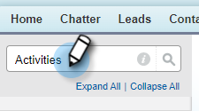

# 將呼叫原因和呼叫結果記錄到Salesforce {#log-call-reasons-and-call-outcomes-to-salesforce}

如果您想要將呼叫結果和呼叫原因記錄到Salesforce以用於報告或可見性用途，則可以為每個活動建立自訂活動欄位。 每個欄位都必須使用特定的API名稱（在Salesforce中稱為「欄位名稱」）。

* 呼叫結果欄位名稱：mktosales_call_ouptue
* 呼叫原因欄位名稱：mktosales_call_reason

若要使用這些欄位，您必須先將欄位建立為自訂活動欄位。 若要讓使用者可見，您必須將其新增至工作物件頁面配置。

## Salesforce Classic {#salesforce-classic}

### 在Salesforce Classic中建立自訂活動欄位  {#create-custom-activity-field-in-salesforce-classic}

1. 在Salesforce中，按一下 **設定**.

   

1. 在「快速查找」框中鍵入「活動」。

   

1. 按一下 **活動自訂欄位**.

   

1. 按一下 **新增**.

   

1. 選取「文字」資料類型，然後按一下 **下一個**.

   

1. 為自訂欄位指定上述定義的欄位名稱。 欄位長度有255個字元的限制。 「欄位標籤」將是銷售團隊可見的欄位，可根據團隊的需求進行自訂。

   

1. 其餘設定為選用。 完成設定後，按一下 **下一個**.

   

1. 為此欄位選擇所需的欄位級安全設定，然後按一下 **下一個** （下圖只是範例）。

   

   >[!NOTE]
   >
   >確保自定義欄位與您的Sales Connect用戶使用的配置檔案一起顯示，以及您希望顯示的任何欄位。

1. 選取要將欄位新增至哪些頁面配置，然後按一下 **儲存** （可選）您可以按一下 **儲存並新增** 並對「呼叫原因」欄位重複此程式)。

   

### 在Salesforce Classic中，將「自訂活動」欄位新增至「工作頁面配置」 {#add-custom-activity-field-to-task-page-layout-in-salesforce-classic}

>[!NOTE]
>
>如果您沒有在上述步驟9中選取所需的頁面配置，則只需遵循這些步驟。

1. 在Salesforce中，按一下 **設定**.

   

1. 在「快速查找」框中鍵入「任務」。

   

1. 按一下 **任務頁面佈局**.

   

1. 按一下 **編輯** 「任務」頁面佈局旁邊。

   

1. 將欄位拖放到「任務」頁面佈局的所需區段。

   

1. 按一下 **儲存**.

   

## Salesforce閃電 {#salesforce-lightning}

### 在Salesforce Lightning中建立自訂活動欄位 {#create-custom-activity-field-in-salesforce-lightning}

1. 在Salesforce中，按一下右上方的齒輪圖示並選取 **設定**.

   

1. 按一下 **物件管理員**.

   

1. 在「快速查找」框中鍵入「活動」。

   

1. 按一下 **活動** 標籤。

   

1. 按一下 **欄位與關係**.

   

1. 按一下 **新增**.

   

## 在Salesforce Lightning中將「自訂活動」欄位新增至「任務」頁面配置 {#add-custom-activity-field-to-task-page-layout-in-salesforce-lightning}

1. 在Salesforce中，按一下右上方的齒輪圖示並選取 **設定**.

   

1. 按一下 **物件管理員**.

   

1. 在「快速查找」框中鍵入「任務」。

   

1. 按一下 **任務** 標籤。

   

1. 按一下 **頁面配置**.

   

1. 按一下pn要添加此欄位的任務頁面佈局。

   

1. 將欄位拖放到「任務」頁面佈局的所需區段。

   

1. 按一下 **儲存**.

   

>[!MORELIKETHIS]
>
>[在活動歷史記錄上安裝銷售連接事件欄位](/help/marketo/product-docs/marketo-sales-connect/crm/salesforce-customization/install-sales-connect-event-fields-on-activity-history.md)
