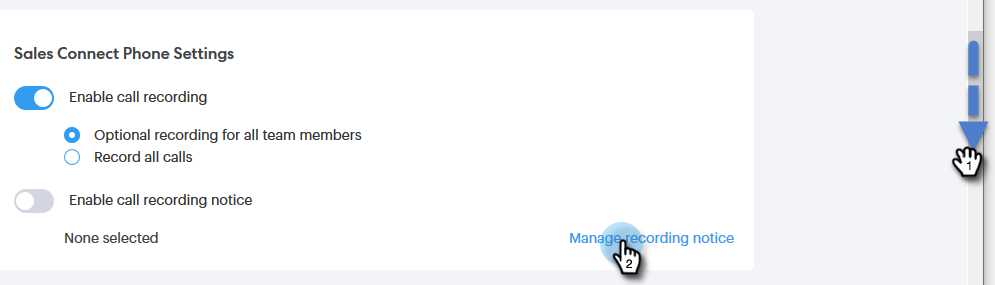

# 雙方同意設定 {#two-party-consent-settings}

為了在記錄呼叫時確保符合美國雙方同意法，身為管理員，您可以啟用您選擇的預先錄制訊息，以在呼叫開始時播放該訊息。

>[!PREREQUISITES]
>
>執行下列步驟之前，您必須先 [啟用呼叫記錄](/help/marketo/product-docs/marketo-sales-connect/phone/enable-call-recording.md).

1. 按一下「設定」圖示並選取 **設定**.

   

1. 在「管理設定」下，按一下 **一般**.

   

1. 向下滾動到Sales Connect Phone Settings ，然後按一下 **管理記錄通知**.

   

1. 按一下 **導入記錄**.

   

   >[!NOTE]
   >
   >僅支援Wav和MP3檔案。 上傳的檔案不能超過30秒。

1. 從硬碟中選擇所需的音頻檔案。

   

1. 上傳完成後，在檔案管理員中選取資料（三個點），然後按一下 **選擇作為同意通知**. 按一下 **確定** 時才能使用。

   

1. 按一下切換，啟用在您錄制的呼叫開始時播放選取的訊息。

   
