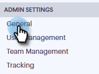

# 雙方同意設定 {#two-party-consent-settings}

為了確保錄音電話時符合美國兩黨同意法，身為管理員，您可以啟用您選擇的預先錄製的訊息，在錄音電話時於通話開始時播放。

>[!PREREQUISITES]
>
>在執行以下步驟之前，您必須先[啟用通話錄製](/help/marketo/product-docs/marketo-sales-connect/phone/enable-call-recording.md)。

1. 按一下「設定」圖示並選取&#x200B;**[!UICONTROL Settings]**。

   

1. 在[!UICONTROL Admin Settings]底下，按一下&#x200B;**[!UICONTROL General]**。

   

1. 向下捲動至[!UICONTROL Sales Connect Phone Settings]並按一下&#x200B;**[!UICONTROL Manage recording notice]**。

   

1. 按一下「**[!UICONTROL Import Recording]**」。

   

   >[!NOTE]
   >
   >僅支援Wav和MP3檔案。 您無法上傳超過30秒的檔案。

1. 從硬碟選取所需的音訊檔案。

   

1. 上傳完成後，在檔案管理員中選取dota （三個點），然後按一下&#x200B;**[!UICONTROL Select as Consent Notice]**。 完成時，按一下&#x200B;**[!UICONTROL OK]**。

   

1. 按一下切換按鈕，即可讓選取的訊息在電話錄音開始時播放。

   
