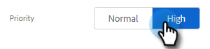

# 建立和分配提醒任務 {#create-and-assign-reminder-tasks}

提醒任務是您與客戶和潛在客戶接洽的最佳方式。 要建立任務，請執行以下步驟。

1. 按一下 **命令中心**。

   

1. 預設情況下將開啟任務。 按一下 **添加任務**。

   

1. 從電子郵件、呼叫、InMail或自定義任務中選擇任務類型。

   

1. 給任務一個名稱。

   

1. 選擇將任務保留為您自己，或選擇另一個用戶將任務分配給您。

   

1. 使用此提醒任務添加您正在跟蹤的人。

   

1. 選擇任務到期日。

   

1. 選擇任務的優先順序。

   

1. 添加在完成任務時希望您能夠獲得的任務的詳細資訊，如呼叫通話備注、InMail郵件模板，甚至有關人員的備注。 按一下 **建立** 完成。

   
