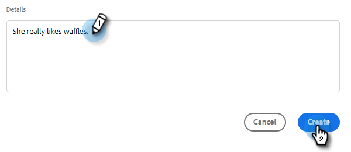

# 建立及指派提醒任務 {#create-and-assign-reminder-tasks}

提醒工作是讓您掌握客戶和潛在客戶參與的最好方法。 若要建立任務，請遵循下列步驟。

1. 按一下 **指揮中心**.

   

1. 預設會開啟任務。 按一下 **新增任務**.

   

1. 從「電子郵件」、「通話」、「InMail」或「自訂任務」選取任務型別。

   

1. 為任務命名。

   

1. 選擇保留指派給自己的任務，或選擇另一個使用者將您的任務指派給。

   

1. 透過此提醒任務新增您正在追蹤的人員。

   

1. 選取工作的到期日。

   

1. 選取工作的優先順序。

   

1. 新增您完成任務時想要使用的任何工作詳細資訊，例如通話記錄、InMail訊息範本，甚至個人相關備註。 按一下 **建立** 完成時。

   
