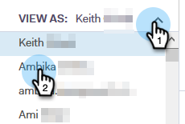

# 以其他使用者的身分檢視範本清單 {#view-template-list-as-another-user}

身為管理員，您可以以任何使用者的身分檢視範本。

>[!NOTE]
>
>**需要管理員權限**

1. 按一下「**[!UICONTROL Templates]**」。

   

1. 按一下&#x200B;**[!UICONTROL View As]**&#x200B;下拉式清單，然後選取想要的使用者。

   

1. 您現在正在以選取的使用者身分檢視範本。

   

   >[!NOTE]
   >
   >您也可以使用篩選器或搜尋功能搭配[!UICONTROL View As]來檢視與您最相關的專案。
