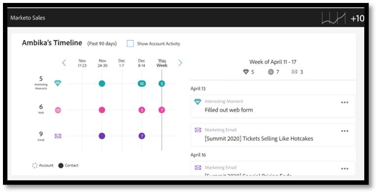

# 動作資料同步常見問題集 {#actions-data-sync-faq}

Sales Insight Actions的資料統一欄位同步可讓系統從Marketo Engage資料庫將人員資訊提取到Sales Insight Actions資料庫中。

如此可在Sales Insight Actions網頁應用程式中提供最新的人員資料，並允許系統收集Marketo中對應人員記錄的唯一ID以及Salesforce中的銷售機會/聯絡人/帳戶/機會記錄，以便能夠正確參考記錄以記錄資料。

您可以從Marketo Engage之「管理員」區段的「銷售分析動作設定」索引標籤啟用此同步處理。 如需詳細資訊，請檢視 [啟動資料同步](/help/marketo/product-docs/marketo-sales-insight/actions/getting-started/sales-insight-actions-admin-setup-guide.md#initiate-data-sync).

上圖顯示人員活動和任務資料如何在系統之間同步。 請注意下列事項：

* 人員記錄會從Marketo Engage同步至銷售分析動作，讓Marketo Engage成為銷售分析動作人員資料的真實來源
* Marketo Engage與銷售分析動作 [具備機制](/help/marketo/product-docs/marketo-sales-insight/actions/email/unsubscribes/syncing-unsubscribes-with-salesforce.md) ，以收集並同步至Salesforce的取消訂閱狀態
* 取消訂閱狀態不會從銷售動作同步到Marketo Engage，但銷售分析動作可以設定為先檢查人員的Marketo取消訂閱狀態，然後再允許賣家傳送電子郵件 [Marketo取消訂閱檢查](/help/marketo/product-docs/marketo-sales-insight/actions/email/unsubscribes/marketo-unsubscribe-check.md).

以下是與資料統一同步如何運作相關的一些常見問題。

## 哪些銷售機會/聯絡人會同步至銷售分析動作？ {#what-lead-contacts-are-synced}

已指定銷售負責人的潛在客戶與聯絡人會同步至「銷售作業」。

您可以檢視現有的標準擁有者欄位，瞭解銷售機會/聯絡人在Salesforce中是否有銷售擁有者。

銷售擁有者不必是Marketo同步使用者或任何特定的Salesforce或銷售使用者。 我們只需在Salesforce中列出的潛在客戶擁有者和聯絡人擁有者欄位中列出使用者，我們就能將其識別為銷售潛在客戶，並將其同步至Sales Insight Actions中。 與我們同步之欄位的任何更新，也會在Sales Insight動作中偵測及更新。

## Sales Insight Smart Grid中顯示的活動資料來自何處？ {#where-does-the-activity-data-get-sourced-from}

電子郵件、電話、有趣的時刻和網頁等活動資料都來自Marketo Engage的資料庫。 Sales Insight Smart Grid會在每次銷售使用者載入Sales Insight面板時，向Marketo Engage執行個體提出擷取此專案的請求。

為確保所有活動資料都可從Marketo Engage取得，銷售分析動作會將所有活動資料同步至Marketo Engage。

## 哪些欄位與從Marketo Engage同步至銷售分析動作的人員記錄有關？ {#what-fields-sync}

有11個欄位會從「Marketo Engage」同步至「銷售分析動作」：

* 名字
* 姓氏
* Salesforce聯絡人ID
* Salesforce銷售機會ID
* Salesforce帳戶ID
* Salesforce機會ID
* Marketo ID
* 公司
* 標題
* 電子郵件
* 電話號碼
* Linkedin URL
* 來源

## 在Marketo Engage與銷售分析動作之間同步的欄位是否可設定？ {#are-the-fields-that-sync-configurable}

無法設定同步至Sales Insight動作的Marketo Engage欄位，也無法對應欄位。 來自Marketo的同步會自動將標準Marketo欄位對應到銷售動作例項中的標準欄位。

## 為什麼Sales Insight Actions有自己的資料庫？ {#why-does-actions-have-its-own-database}

Sales Insight Actions有其專屬的網頁應用程式，其中包含專屬的人員與活動資料庫，可提供專為銷售團隊建立及設計的最佳化工作區。 這可讓銷售經理和賣家擁有建立和管理其參與策略的空間，而無需授予主要Marketo Engage工作區的存取權或許可權，而這是為行銷作業專家最佳化的工作區。

## 如何處理重複專案？ {#how-are-duplicates-handled}

您的Sales Actions資料庫將是存在於您的Marketo Engage資料庫中的合格人員（具有銷售負責人的潛在客戶/聯絡人）的副本。 也就是說，如果在Marketo中建立了兩個具有相同電子郵件地址的記錄，則在「銷售動作」中將會建立重複的記錄。

## 初始同步處理需要多久的時間才能完成？ {#how-long-initial-sync}

將所有銷售機會資料同步至新的Sales Insight Actions執行個體的初始程式，通常每1-2分鐘會處理大約1,000名人員。 這只是估計值，可能會有所不同。

進行初始同步且已將您的所有銷售機會填入您的Sales Insight Actions網頁應用程式執行個體後，每次更新已同步的支援欄位之一時，就會執行增量同步。

## Sales Insight Actions使用者是否可以在Actions Web應用程式中編輯人員資料？ {#can-actions-users-edit-people-data}

否，「動作」網頁應用程式的使用者和管理員都無法在「動作」中建立及編輯人員記錄。 建立及編輯人員必須在Salesforce或Marketo Engage中完成。 Sales Insight Actions會持續同步新資料，以使用Marketo作為人員資料的信任來源，因此，如果在Marketo中從Marketo的工作流程更新或建立人員，或是從Salesforce同步人員，這些更新都會傳遞至Sales Insight Actions網頁應用程式資料庫。

## 銷售活動會記錄到Marketo嗎？ {#do-sales-activities-log-to-marketo}

是，銷售參與活動會以原生活動的形式登入Marketo。 這些活動也包含原生篩選器，可搭配條件約束使用，以根據銷售活動屬性來鎖定潛在客戶。

以下是登入Marketo的活動清單：

* 傳送銷售電子郵件
* 開啟銷售電子郵件
* 按一下銷售電子郵件
* 已回覆銷售電子郵件
* 銷售電子郵件已退回
* 已接聽銷售電話
* 新增至銷售行銷活動
* 已從銷售行銷活動中移除

## 銷售活動是否記錄到Salesforce？ {#do-sales-activities-log-to-salesforce}

是的，銷售參與活動會以原生作業的形式登入Salesforce。 這些工作隨後可用於Salesforce報表，以支援追蹤銷售活動的團隊儀表板。

Sales Insight Actions可讓管理員設定哪些銷售活動記錄到Salesforce。 這些活動包括電子郵件、來電和開啟提醒工作。

上圖顯示哪些資訊記錄到Salesforce。 電子郵件和來電等活動會記錄到 [單向同步](/help/marketo/product-docs/marketo-sales-insight/actions/crm/salesforce-integration/salesforce-sync-settings.md). [取消訂閱](/help/marketo/product-docs/marketo-sales-insight/actions/email/unsubscribes/syncing-unsubscribes-with-salesforce.md) 和 [提醒任務](/help/marketo/product-docs/marketo-sales-insight/actions/tasks/reminder-task-sync-with-salesforce.md) 會透過雙向同步功能保持最新狀態。 這些資料同步可從Sales Insight Actions網頁應用程式介面設定。

>[!MORELIKETHIS]
>
>* [正在與Salesforce同步取消訂閱](/help/marketo/product-docs/marketo-sales-insight/actions/email/unsubscribes/syncing-unsubscribes-with-salesforce.md)
>* [Marketo取消訂閱檢查](/help/marketo/product-docs/marketo-sales-insight/actions/email/unsubscribes/marketo-unsubscribe-check.md)
>* [Salesforce同步設定](/help/marketo/product-docs/marketo-sales-insight/actions/crm/salesforce-integration/salesforce-sync-settings.md)
>* [提醒任務與Salesforce同步](/help/marketo/product-docs/marketo-sales-insight/actions/tasks/reminder-task-sync-with-salesforce.md)
>* [啟動資料同步](/help/marketo/product-docs/marketo-sales-insight/actions/getting-started/sales-insight-actions-admin-setup-guide.md#initiate-data-sync)

