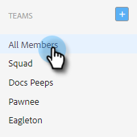

# 建立團隊 {#creating-a-team}

建立團隊可讓您組合一組使用者，讓內容可與共用，並依篩選報表。

## 建立團隊 {#create-a-team}

1. 在 [網頁應用程式](https://toutapp.com/login)，按一下齒輪圖示並選取 **設定**.

   

1. 在「管理設定」下，選取 **團隊管理**.

   

1. 在「團隊」旁邊，按一下 **+** 表徵圖。

   

1. 輸入團隊名稱，然後按一下 **建立**.

   

>[!NOTE]
>
>您現在可以與該團隊共用範本、行銷活動和群組。

## 將人員添加到團隊 {#add-people-to-a-team}

1. 仍在團隊管理中，請選取 **所有成員**.

   

1. 找出您要新增至團隊的使用者，並選取其核取方塊。

   

1. 按一下 **新增至團隊**.

   

1. 按一下下拉式清單，然後選取您想要的團隊。

   

1. 按一下 **新增** 時才能使用。

   
