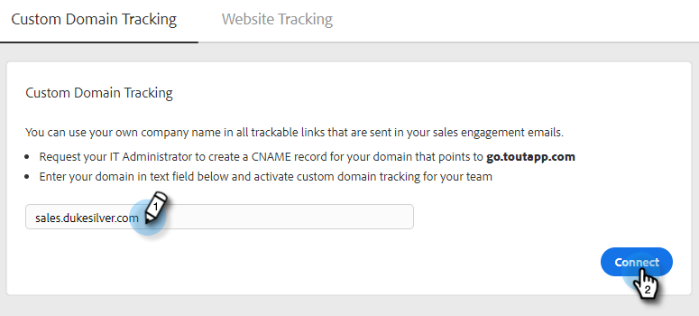

# 如何設定自訂網域追蹤 {#how-to-set-up-custom-domain-tracking}

自訂網域追蹤可讓您的團隊在新增至銷售電子郵件的所有可追蹤連結中使用您自己的公司名稱。 設定完此設定後，我們會允許將您電子郵件中的任何連結顯示為go.yourcompany.com，這樣當有人暫留連結時，該連結將會讀取go.yourcompany.com，而非go.toutapp.com。

您需要IT團隊的協助，為指向go.toutapp.com的網域設定CNAME記錄。 此CNAME會顯示在您的所有追蹤連結上（例如go.yourcompany.com）。

在您向IT團隊確認CNAME已正確設定後，即可將其新增至動作中的自訂網域追蹤頁面。

>[!NOTE]
>
>如果您的CNAME未正確設定，而您在「動作」中以自訂網域的形式啟動CNAME，可能會中斷追蹤連結和像素。

## 啟用自訂網域追蹤 {#enable-custom-domain-tracking}

>[!NOTE]
>
>**需要管理員權限。**

1. 按一下齒輪圖示並選取 **設定**.

   

1. 在「管理設定」下，選取 **追蹤**.

   

1. 在「自訂網域追蹤」標籤中，輸入您的CNAME，然後按一下 **Connect**.

   
