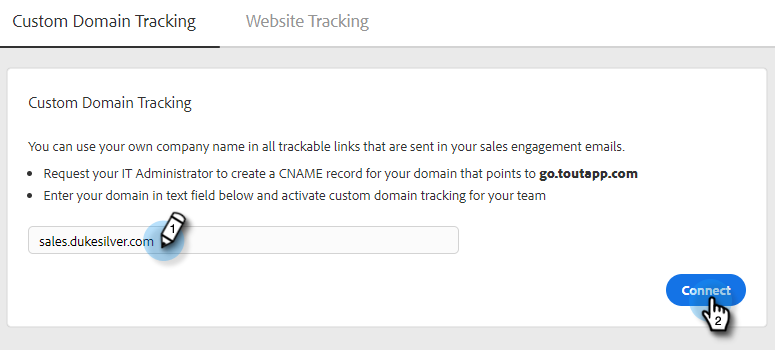

# 如何設定自訂網域追蹤 {#how-to-set-up-custom-domain-tracking}

自訂網域追蹤可讓您的團隊在新增至銷售電子郵件的所有可追蹤連結中，使用您自己的公司名稱。 完成此設定後，我們將允許列出您在電子郵件中的所有連結，以顯示為go.yourcompany.com，這樣當有人將滑鼠游標停留在連結上時，將會顯示go.yourcompany.com而非go.toutapp.com。

您需要IT團隊的協助，才能為指向go.toutapp.com的網域設定CNAME記錄。 此CNAME會出現在您的所有追蹤連結（例如go.yourcompany.com）上。

一旦IT團隊確認CNAME已正確設定，您就可以將其新增至「動作」中的「[!UICONTROL Custom Domain Tracking]」頁面。

>[!NOTE]
>
>如果您的CNAME未正確設定，且您在「動作」中將其啟動為自訂網域，則可能會破壞追蹤連結和畫素。

## 啟用自訂網域追蹤 {#enable-custom-domain-tracking}

>[!NOTE]
>
>**需要系統管理員許可權。**

1. 按一下齒輪圖示並選取&#x200B;**[!UICONTROL Settings]**。

   

1. 在[!UICONTROL Admin Settings]下，選取&#x200B;**[!UICONTROL Tracking]**。

   

1. 在[!UICONTROL Custom Domain Tracking]索引標籤中，輸入您的CNAME並按一下&#x200B;**[!UICONTROL Connect]**。

   
