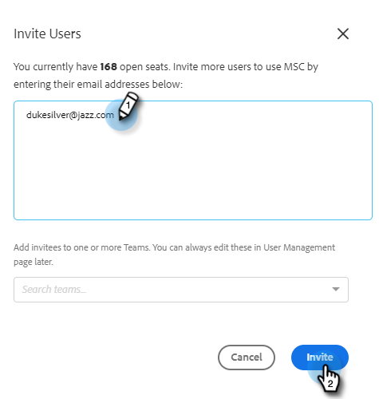

# 邀請用戶和管理員 {#invite-users-and-admins}

添加用戶或管理員快速而輕鬆！

## 邀請用戶 {#invite-users}

1. 按一下齒輪表徵圖並選擇 **設定**。

   

1. 在「管理設定」下，選擇 **用戶管理**。

   

1. 按一下 **操作** 按鈕 **邀請用戶**。

   

   >[!NOTE]
   >
   >也可以選擇 **通過CSV邀請用戶** 如果你把它們都列在電子錶格中。

1. 輸入要添加的個人的電子郵件地址，然後按一下 **邀請** （可選擇要添加到的團隊）。

   

   >[!NOTE]
   >
   >預設情況下，所有新成員都將添加到「每個人」團隊。

1. 按一下 **確定**。

   

## 使用戶成為管理員 {#make-a-user-an-admin}

>[!NOTE]
>
>**需要管理權限**

按照以下步驟使現有用戶成為管理員。

1. 按一下齒輪表徵圖並選擇 **設定**。

   

1. 在「管理設定」下，選擇 **用戶管理**。

   

1. 查找要建立管理員的用戶，按一下「角色」下拉框，然後選擇 **管理**。

   

很簡單！
