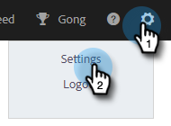

# 登入管理設定 {#login-management-settings}

登入管理設定可讓管理員在全域層級設定Sales Insight動作使用者的驗證偏好設定。

>[!NOTE]
>
>依預設，[!UICONTROL Salesforce Only]執行個體將選取[!DNL Sales Insight Actions]選項。 我們建議使用此設定，讓使用者可以從[中](/help/marketo/product-docs/marketo-sales-insight/actions/admin/auto-login-from-salesforce.md)自動登入[!DNL Salesforce]。

## 更新登入管理設定 {#update-login-management-settings}

>[!NOTE]
>
>**需要管理員許可權**

請依照以下步驟更新您的登入管理偏好設定。

1. 按一下齒輪圖示並選取&#x200B;**[!UICONTROL Settings]**。

   

1. 在[!UICONTROL Admin Settings]底下，按一下&#x200B;**[!UICONTROL General]**。

   

1. 向下捲動至「[!UICONTROL Login Management]」卡片並選取所需的設定(在此範例中，我們選擇「僅限Salesforce」)。 完成時，按一下&#x200B;**[!UICONTROL Save]**。

   

## 僅限Salesforce常見問題集 {#salesforce-only-faq}

「僅限Salesforce」表示使用者只能驗證以搭配[!DNL Sales Insight Actions]使用[!DNL Salesforce]。 這是[!DNL Sales Insight Actions]執行個體的預設選擇，之所以建議使用，是因為它允許使用者進行無縫驗證，而不需要管理使用者名稱和密碼。

### 選取&quot;[!UICONTROL Salesforce Only]&quot;時，我執行個體的新使用者如何啟用其帳戶？ {#activate-when-salesforce-only-is-selected}

按一下邀請電子郵件中的「**[!UICONTROL Getting Started]**」按鈕後，系統會將新使用者傳送至帳戶啟用畫面，要求他們連線其Salesforce執行個體，以啟用其[!DNL Sales Insight Actions]帳戶。

### 選取「[!UICONTROL Salesforce Only]」時，允許我的使用者使用哪些驗證方法進行驗證？ {#what-authentication-methods}

導覽至我們的登入畫面時，使用者會先輸入電子郵件地址。 接著，他們會按一下Salesforce 「按一下[!UICONTROL Login]」按鈕，他們便可以使用登入的Salesforce帳戶進行驗證。

>[!NOTE]
>
>這僅與直接導覽至登入畫面的使用者有關。 從[!DNL Salesforce]存取動作的使用者將使用[自動登入](/help/marketo/product-docs/marketo-sales-insight/actions/admin/auto-login-from-salesforce.md)登入。

### 當使用者存取來自Salesforce的動作功能且已選取「僅限Salesforce」時，如何處理動作的使用者驗證？ {#how-is-user-authentication-handled}

當使用者按一下其中一個動作（呼叫、電子郵件、行銷活動、任務、行銷活動清單等……），我們使用他們的SFDC驗證自動將其登入其[!DNL Sales Insight Actions]帳戶。 我們將此驗證稱為[自動登入](/help/marketo/product-docs/marketo-sales-insight/actions/admin/auto-login-from-salesforce.md)。

## 所有登入方法常見問題集 {#all-login-methods-faq}

### 選取「所有登入方法」時，我執行個體的新使用者如何啟動其帳戶？ {#activate-when-all-login-methods-is-selected}

當新的使用者受邀加入執行個體時，他們將收到帳戶啟用電子郵件。 他們將會按一下顯示「開始使用」的按鈕，然後前往要求他們建立並確認密碼的頁面。 建立後，他們的帳戶將會啟用，並透過上線工作流程領取。

### 選取&quot;[!UICONTROL All Login Methods]&quot;時，允許我的執行個體的使用者使用哪些專案登入？ {#what-are-users-allowed-to-log-in-with-all-login}

使用我們的登入頁面時，使用者將先輸入其電子郵件地址。 接著，系統會將使用者傳送至頁面，提供所有登入選項(使用者名稱/密碼、SFDC、Gmail、SSO)，以利使用者進行驗證。
