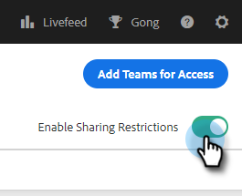

# 共用設定 {#sharing-settings}

通過限制用戶可以共用的內容和與哪些類別共用，更好地管理模板。

首次建立Sales Connect帳戶時，將啟用「共用設定」。 這樣，您的帳戶管理員就有機會在開啟閘門之前建立和組織您的模板類別，並允許用戶將內容共用到您的團隊類別中。

啟用「共用設定」後，只有管理員才能共用到類別中，除非向團隊或每個人提供共用權限。 禁用了「共用設定」後，不存在任何限制，所有用戶都可以共用到任何模板類別中。

## 配置共用設定 {#configure-your-sharing-settings}

1. 在 [Web應用](https://toutapp.com/login)，按一下齒輪表徵圖並選擇 **設定**。

   

1. 在「管理設定」下，選擇 **共用訪問**。

   

1. 確保 **共用設定** 的子菜單。 這意味著預設情況下，只有管理員才能共用模板類別中的模板。

   

1. 選擇要配置的模板類別。

   

1. 按一下 **添加團隊以訪問**。

   

1. 選擇要添加的團隊。

   

   >[!NOTE]
   >
   >如果您沒有看到任何團隊，則需要轉到「團隊管理」並建立一個用戶團隊。

1. 按一下 **添加團隊以訪問** 來保存。

   

1. 添加了您的團隊後，您可以選擇僅允許團隊管理員共用該團隊或該團隊上的所有用戶。 在本示例中，我們將為SDR團隊中的所有用戶提供共用訪問權限。

   
