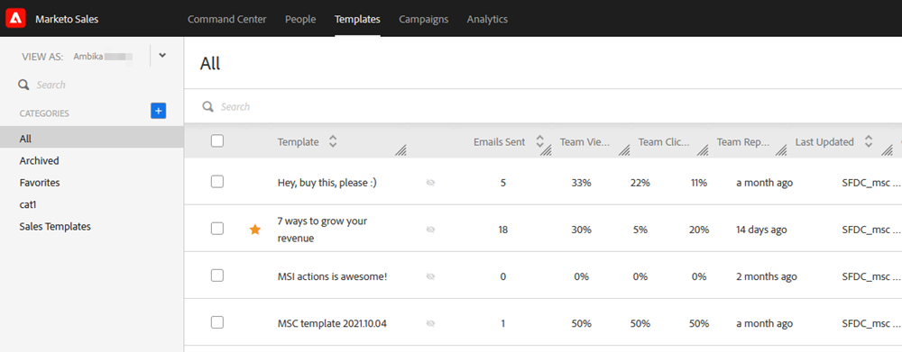
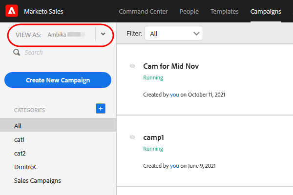

# 使用者存取詳細資訊 {#user-access-details}

管理員與非管理員有哪些存取權？

## 管理員使用者權限 {#admin-user-permissions}

管理員可 [查看所有模板](/help/marketo/product-docs/marketo-sales-connect/templates/view-template-list-as-a-another-user.md).

管理員可 [檢視所有促銷活動](/help/marketo/product-docs/marketo-sales-connect/campaigns/view-campaigns-list-as-another-user.md).

管理員可以檢視所有電子郵件活動。

管理員可以查看執行中行銷活動的所有人員。

管理員可透過「檢視方式」下拉式清單查看使用者促銷活動和促銷活動類別。

管理員可以代表使用者停止促銷活動。

## 非管理員使用者權限 {#non-admin-user-permissions}

* Analytics:

   * 使用者可以看到團隊分析
   * 使用者只能深入鑽研所屬的團隊
   * 使用者可以查看自己的分析

* 人員頁面：

   * 使用者可與所有人共用群組
   * 使用者只能與其所屬的團隊共用群組
   * 使用者可看見您動作資料庫中的所有人
   * 刪除用戶後，其共用聯繫人會將所有權轉移給刪除該用戶的主管理員

* 團隊管理頁：

   * 無法查看

* 「模板」頁：

   * 使用者可與所有人共用範本
   * 使用者可以按照其管理員允許的類別共用範本
   * 從團隊中移除使用者時，其範本會取消與該團隊共用
   * 從團隊中刪除使用者時，其範本會將所有權轉移給刪除該使用者的主管理員
