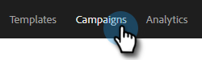
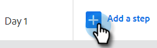
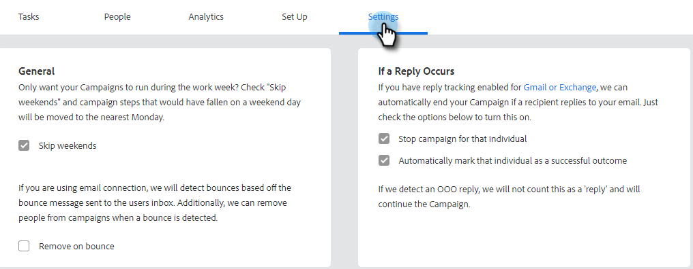

# 建立銷售行銷活動 {#create-a-sales-campaign}

銷售行銷活動是一系列多管道步驟，包括：電子郵件、電話、InMail和自訂工作。 它們可讓您簡化與潛在客戶及現有客戶的通訊。

您可以使用銷售促銷活動來：

* **組織**：在一個地方簡化所有外展活動，以有效執行。
* **縮放**：排程您所有的外聯工作，以便您可以擴大工作規模、減少手動工作，並視需要個人化。
* **量值**：在自動登入[!DNL Salesforce]的同時，在一個位置追蹤您所有電子郵件和工作的成功。 瞭解哪些因素能引起共鳴並導致結果，您就能持續測試並改善結果。

那麼，如何設定促銷活動？

1. 按一下「**[!UICONTROL Campaigns]**」標籤。

   

1. 選取類別並按一下&#x200B;**[!UICONTROL Create New Campaign]**&#x200B;按鈕。

   

   >[!NOTE]
   >
   >按一下&#x200B;**旁的**+**[!UICONTROL Categories]**&#x200B;以建立新類別。

1. 將會選取您選擇的類別。 如果您改變心意，請按一下下拉式清單並選取其他選項。 完成後，按一下「**[!UICONTROL Continue]**」。

   

1. 按一下「**[!UICONTROL Add a Step]**」。

   

1. 選擇：電子郵件、通話、InMail或自訂工作。 在此範例中，我們選擇「電子郵件」。

   

1. 當您[完成電子郵件](/help/marketo/product-docs/marketo-sales-insight/actions/campaigns/sales-campaign-step-types-and-reminder-tasks.md#email){target="_blank"}時，請按一下&#x200B;**[!UICONTROL Add]**。

   

1. 在您建立第一天和步驟後，&quot;[!UICONTROL Add a Day]&quot;按鈕會啟用，而且您可以視銷售流程需要新增多少天和步驟。

   

   >[!NOTE]
   >
   >「天數」不是動作之間的天數，而是順序中的天數。 例如，如果您的促銷活動將持續7天，輸入&#39;3&#39;表示動作將在7的第3天結束，**不會** 3天後結束。

1. 請務必造訪您促銷活動的&#x200B;**[!UICONTROL Settings]標籤**&#x200B;來自訂排程和回複選項，例如略過週末（非常棒）。

   

現在該開始新增人員了！

>[!MORELIKETHIS]
>
>* [促銷活動步驟型別和提醒工作](/help/marketo/product-docs/marketo-sales-insight/actions/campaigns/sales-campaign-step-types-and-reminder-tasks.md){target="_blank"}
>* [促銷活動設定](/help/marketo/product-docs/marketo-sales-insight/actions/campaigns/sales-campaign-settings.md){target="_blank"}
