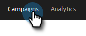

# 銷售活動設定 {#sales-campaign-settings}

「銷售活動設定」部分允許您配置特定的銷售活動，以便它能夠最適合您團隊對該銷售活動的使用案例。

## 跳過週末 {#skip-weekends}

啟用跳過週末，以便週末（星期六或星期日）發生的任何步驟都將移至星期一。

>[!NOTE]
>
>啟用「跳過週末」後，將根據5天周安排電子郵件。 這意味著，在計畫步驟時，週末將忽略為天。

1. 按一下 **市場活動**。

   

1. 選擇所需的銷售活動。

   

1. 按一下 **設定** 頁籤。

   

1. 選擇 **跳過週末** 複選框。

   

## 彈出時刪除 {#remove-on-bounce}

如果您使用電子郵件連接，我們將根據發送到用戶收件箱的彈回消息檢測回報。 此外，當檢測到反彈時，我們可以從銷售活動中刪除人員。

1. 按一下 **市場活動**。

   

1. 選擇所需的銷售活動。

   

1. 按一下 **設定** 頁籤。

   

1. 選擇 **彈出時刪除** 複選框。

   

## 如果發生回復 {#if-a-reply-occurs}

如果您為Gmail或Exchange啟用了回復跟蹤，則如果收件人回復您的電子郵件，我們可以自動結束您的促銷活動。

1. 按一下 **市場活動**。

   

1. 選擇所需的銷售活動。

   

1. 按一下 **設定** 頁籤。

   

1. 下 **如果發生回復**，進行所需的選擇。

   

>[!MORELIKETHIS]
>
>* [建立銷售活動](/help/marketo/product-docs/marketo-sales-insight/actions/campaigns/create-a-sales-campaign.md){target=&quot;_blank&quot;
>* [瞭解銷售活動發送電子郵件步驟的發送選項](/help/marketo/product-docs/marketo-sales-insight/actions/campaigns/understanding-sales-campaign-send-options-for-email-steps.md){target=&quot;_blank&quot;
>* [銷售活動步驟類型和提醒任務](/help/marketo/product-docs/marketo-sales-insight/actions/campaigns/sales-campaign-step-types-and-reminder-tasks.md){target=&quot;_blank&quot;

