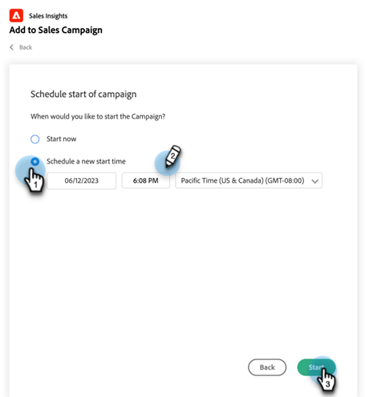
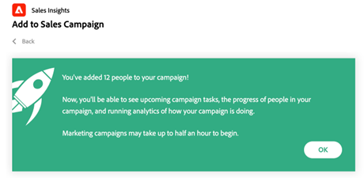

# 在Salesforce中使用大量新增至Sales Campaign {#using-bulk-add-to-sales-campaign-in-salesforce}

瞭解如何在Salesforce中大量新增至Sales Campaign，以使用Sales Actions協助擴大您的對外通訊。

>[!NOTE]
>
>Salesforce強制限製為一次只能選取200筆記錄。

>[!PREREQUISITES]
>
>確定您已安裝 [最新Sales Insight套件](/help/marketo/product-docs/marketo-sales-insight/msi-for-salesforce/upgrading/upgrading-your-msi-package.md){target="_blank"} to your Salesforce instance and have configured the [Action buttons](/help/marketo/product-docs/marketo-sales-insight/actions/crm/salesforce-package-configuration/add-action-buttons-to-salesforce-list-view.md){target="_blank"} 在Salesforce中檢視您的聯絡人和潛在客戶清單。

## 在Salesforce Lightning中大量新增至促銷活動 {#bulk-add-to-sales-campaign-in-salesforce-lightning}

1. 在Salesforce中，按一下 **潛在客戶/聯絡人** 標籤。

   

1. 在 **檢視** 從下拉式清單中，選取您要傳送電子郵件給潛在客戶/連絡人的所需檢視。

   >[!TIP]
   >
   >您可以按一下右側的齒輪圖示並選取 **新增**. 在您為檢視指定新名稱並儲存後，您可以按一下右側的篩選圖示，以協助篩選至您要傳送電子郵件的潛在客戶/聯絡人集合。

1. 選擇所需的潛在客戶或聯絡人清單，然後按一下 **新增至銷售行銷活動** 按鈕。

   

1. 系統會將您導覽至Actions Sales Campaign強制回應視窗，並顯示您選取的收件者。

1. 進行任何必要的編輯以移除人員或群組，然後按一下 **下一個**.

   

1. 從「類別」下拉式清單中選取您要使用的促銷活動類別。

1. 選取您要新增所選人員的銷售促銷活動，然後按一下 **下一個**.

   

1. 視行銷活動的第一步為何，您可能會看到不同的選項。 如果您的第一步是電子郵件，您可以選擇編輯每個收件者的電子郵件，如下所示。 完成此操作後，按一下 **下一個**.

   

1. 同樣地，如果您的第一步是電子郵件，且您已將其設定為允許您選取行銷活動何時啟動，則您將可以選擇執行以下動作： **立即開始** 或 **排程新的開始時間**. 完成此操作後，按一下 **開始**.

   

按一下「開始」後，您會看到確認畫面，讓您知道已新增多少人員。

## 在Salesforce Classic中大量新增至Sales Campaign {#bulk-add-to-sales-campaign-in-salesforce-classic}

1. 在Salesforce中，按一下 **潛在客戶/聯絡人** 標籤。

1. 在「檢視」下拉式清單中，選取您要以電子郵件傳送的潛在客戶/聯絡人檢視，然後按一下 **前往**.

   

   >[!TIP]
   >
   >您可以按一下「建立新檢視」並設定可用的篩選條件，以縮小您要傳送電子郵件的收件者清單，藉此建立新檢視。

1. 選擇所需的潛在客戶或聯絡人清單，然後按一下 **新增至銷售行銷活動** 按鈕。

   

1. 系統會將您導覽至「Actions Sales Campaign」強制回應視窗，其中包含您選取的新增人員。

1. 進行任何必要的編輯以移除人員或群組，然後按一下 **下一個**.

   

1. 從以下專案選取您要使用的促銷活動類別： **類別** 下拉式清單。

1. 選取您要新增所選人員的銷售促銷活動，然後按一下 **下一個**.

   

1. 視行銷活動的第一步為何，您可能會看到不同的選項。 如果您的第一步是電子郵件，您可以選擇編輯每個收件者的電子郵件，如下所示。 完成此操作後，按一下 **下一個**.

   

1. 同樣地，如果您的第一步是電子郵件，且您已將其設定為允許您選取行銷活動何時啟動，則您將可以選擇執行以下動作： **立即開始** 或 **排程新的開始時間**. 完成此操作後，按一下 **開始**.

   

按一下「開始」後，您會看到確認畫面，讓您知道已新增多少人員。

