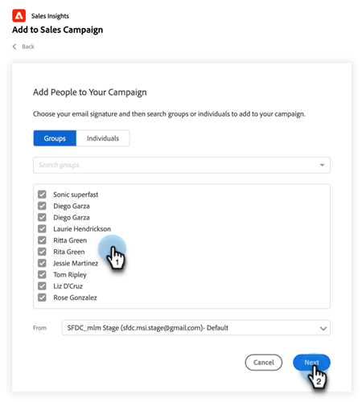
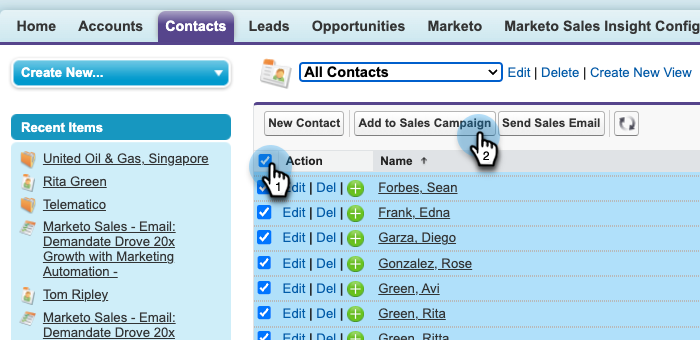

# 在Salesforce中使用大量新增至促銷活動 {#using-bulk-add-to-sales-campaign-in-salesforce}

瞭解如何在Salesforce中大量新增至銷售促銷活動，以使用銷售動作協助擴展您的對外通訊。

>[!NOTE]
>
>Salesforce強制限制200筆可一次選取的記錄。

>[!PREREQUISITES]
>
>請確定您已將[最新Sales Insight套件](/help/marketo/product-docs/marketo-sales-insight/msi-for-salesforce/upgrading/upgrading-your-msi-package.md){target="_blank"}安裝至您的Salesforce執行個體，並在Salesforce的連絡人和潛在客戶清單檢視上設定了[動作按鈕](/help/marketo/product-docs/marketo-sales-insight/actions/crm/salesforce-package-configuration/add-action-buttons-to-salesforce-list-view.md){target="_blank"}。

## 在Salesforce Lightning中大量新增至促銷活動 {#bulk-add-to-sales-campaign-in-salesforce-lightning}

1. 在Salesforce中，按一下&#x200B;**銷售機會/聯絡人**&#x200B;索引標籤，以瀏覽至銷售機會/聯絡人首頁。

   

1. 在&#x200B;**檢視**&#x200B;下拉式清單中，選取想要的要傳送電子郵件給潛在客戶/連絡人的檢視。

   >[!TIP]
   >
   >您可以按一下右側的齒輪圖示並選取&#x200B;**新增**，以建立新的檢視。 當您為檢視提供新名稱並儲存後，可以按一下右側的篩選圖示，以協助篩選至您要傳送電子郵件的潛在客戶/聯絡人集合。

1. 選擇所需的潛在客戶或聯絡人清單，然後按一下&#x200B;**新增至銷售行銷活動**&#x200B;按鈕。

   

1. 系統會將您導覽至「Actions Sales Campaign」強制回應視窗，其中包含您選取的收件者。

1. 進行任何必要的編輯以移除人員或群組，然後按一下[下一步] ****。

   

1. 從「類別」下拉式清單中選取您要使用的促銷活動類別。

1. 選取您要新增選取人員的促銷活動，然後按一下[下一步] ****。

   

1. 視行銷活動中的第一個步驟而定，您可能會看到不同的選項。 如果您的第一步是電子郵件，您可以選擇編輯每個收件者的電子郵件，如下所示。 完成之後，按一下&#x200B;**下一步**。

   

1. 同樣地，如果您的第一步是電子郵件，並且您已將其設定為允許您選取行銷活動啟動的時間，您將可以選擇&#x200B;**立即開始**&#x200B;或&#x200B;**排程新的開始時間**。 完成之後，請按一下[開始]。****

   

按一下「開始」後，您會看到確認畫面，讓您知道已新增多少人員。

## 在Salesforce Classic中大量新增至Sales Campaign {#bulk-add-to-sales-campaign-in-salesforce-classic}

1. 在Salesforce中，按一下&#x200B;**銷售機會/聯絡人**&#x200B;標籤。

1. 在[檢視]下拉式清單中，選取想要的要傳送電子郵件的潛在客戶/連絡人檢視，然後按一下[執行]。****

   

   >[!TIP]
   >
   >您可以按一下「建立新檢視」並設定可用的篩選器，以縮小您要傳送電子郵件的收件者清單，藉此建立新檢視。

1. 選擇所需的潛在客戶或連絡人清單，然後按一下&#x200B;**新增至促銷活動**&#x200B;按鈕。

   

1. 系統會將您導覽至「Actions銷售促銷活動」強制回應視窗，其中包含您選取的已新增人員。

1. 進行任何必要的編輯以移除人員或群組，然後按一下[下一步] ****。

   

1. 從&#x200B;**類別**&#x200B;下拉式清單中選取您要使用的促銷活動類別。

1. 選取您要新增選取人員的促銷活動，然後按一下[下一步] ****。

   

1. 視行銷活動中的第一個步驟而定，您可能會看到不同的選項。 如果您的第一步是電子郵件，您可以選擇編輯每個收件者的電子郵件，如下所示。 完成之後，按一下&#x200B;**下一步**。

   

1. 同樣地，如果您的第一步是電子郵件，並且您已將其設定為允許您選取行銷活動啟動的時間，您將可以選擇&#x200B;**立即開始**&#x200B;或&#x200B;**排程新的開始時間**。 完成之後，請按一下[開始]。****

   

按一下「開始」後，您會看到確認畫面，讓您知道已新增多少人員。

