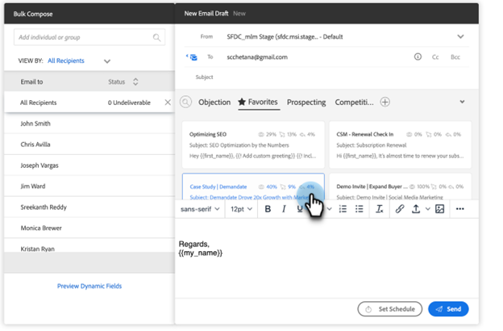

# 在Salesforce中使用大量傳送銷售電子郵件 {#using-bulk-send-sales-email-in-salesforce}

瞭解如何在Salesforce中傳送大量電子郵件，以透過銷售動作協助擴展您的對外通訊。

>[!NOTE]
>
>Salesforce強制限製為一次只能選取200筆記錄。

>[!PREREQUISITES]
>
>確定您已安裝 [最新Sales Insight套件](/help/marketo/product-docs/marketo-sales-insight/msi-for-salesforce/upgrading/upgrading-your-msi-package.md){target="_blank"} to your Salesforce instance and have configured the [Action buttons](/help/marketo/product-docs/marketo-sales-insight/actions/crm/salesforce-package-configuration/add-action-buttons-to-salesforce-list-view.md){target="_blank"} 在Salesforce中檢視您的聯絡人和潛在客戶清單。

## 在Salesforce Lightning中傳送大量電子郵件 {#sending-bulk-email-in-salesforce-lightning}

1. 在Salesforce中，按一下 **潛在客戶/聯絡人** 標籤。

   

1. 在「檢視」下拉式清單中，選取您要傳送電子郵件給潛在客戶/連絡人的所需檢視。

   >[!TIP]
   >
   >您可以按一下右側的齒輪圖示並選取 **新增**. 在您為檢視指定新名稱並儲存後，您可以按一下右側的篩選圖示，以協助篩選至您要傳送電子郵件的潛在客戶/聯絡人集合。

1. 選擇所需的潛在客戶或聯絡人清單，然後按一下 **傳送銷售電子郵件** 按鈕。

   

1. 系統會將您導覽至「動作撰寫」視窗，並新增您選取的人員。

1. 選取您要插入至「動作」撰寫視窗編輯器的範本，或撰寫自訂電子郵件。

   >[!TIP]
   >
   >使用 [釘選類別](/help/marketo/product-docs/marketo-sales-insight/actions/email/using-the-compose-window/using-a-template-in-the-compose-window.md#pinning-template-categories-in-the-compose-window){target="_blank"} 讓您更輕鬆地存取您最愛的電子郵件範本。

   **選擇性步驟**：按一下「 」，預覽任何動態欄位個人化 **預覽動態欄位** 按鈕。

   >[!TIP]
   >
   >如果您想要自訂所有收件者的範本，按一下大量撰寫側邊欄中的所有收件者選項，可讓您同時編輯所有收件者的電子郵件。 如果您想要變更特定電子郵件，請在「大量撰寫」側邊欄中按一下收件者的名稱或電子郵件。 請注意，如果您在選取「所有收件者」時變更個別電子郵件，然後進行變更，則對「所有收件者」所做的變更將會覆寫對個別電子郵件所做的變更。

1. 選取 **傳送** 立即傳送電子郵件，或 **設定排程** 以設定傳送電子郵件的日期和時間。

   

## 在Salesforce Classic中傳送大量電子郵件 {#sending-bulk-email-in-salesforce-classic}

1. 在Salesforce中，按一下 **潛在客戶/聯絡人** 標籤。

1. 在「檢視」下拉式清單中，選取您要以電子郵件傳送的潛在客戶/聯絡人檢視，然後按一下 **前往**.

   

   >[!TIP]
   >
   >您可以按一下「建立新檢視」並設定可用的篩選器，以縮小新增至促銷活動的對象清單，藉此建立新檢視。

1. 選擇所需的潛在客戶或聯絡人清單，然後按一下 **傳送銷售電子郵件** 按鈕。

1. 系統會將您導覽至動作撰寫視窗，其中包含您在撰寫視窗中選取的收件者。

1. 選取您要插入至「動作撰寫」視窗編輯器的範本，或撰寫自訂電子郵件。

   

   >[!TIP]
   >
   >使用 [釘選類別](/help/marketo/product-docs/marketo-sales-insight/actions/email/using-the-compose-window/using-a-template-in-the-compose-window.md#pinning-template-categories-in-the-compose-window){target="_blank"} 讓您更輕鬆地存取您最愛的電子郵件範本。

   **選擇性步驟**：按一下「 」，預覽任何動態欄位個人化 **預覽動態欄位** 按鈕。

   >[!TIP]
   >
   >如果您想要自訂所有收件者的範本，按一下大量撰寫側邊欄中的所有收件者選項，可讓您同時編輯所有收件者的電子郵件。 如果您想要變更特定電子郵件，請在「大量撰寫」側邊欄中按一下收件者的名稱或電子郵件。 請注意，如果您在選取「所有收件者」時變更個別電子郵件，然後進行變更，則對「所有收件者」所做的變更將會覆寫對個別電子郵件所做的變更。

1. 選取 **傳送** 立即傳送電子郵件，或 **設定排程** 以設定傳送電子郵件的日期和時間。
