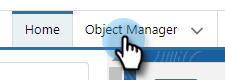
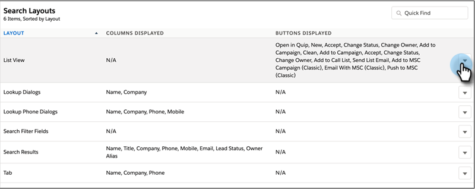

# 卸載Salesforce Lightning自定義程式包 {#uninstall-salesforce-lightning-customization-package}

開始使用MSI操作包後，從Salesforce帳戶卸載MarketoSales Connect包。

## 從頁面佈局中刪除「Sales Connect」欄位 {#remove-sales-connect-fields-from-page-layout}

1. 在Salesforce Lightning中，按一下齒輪表徵圖並選擇 **設定**。

   

1. 按一下 **對象管理器**。

   

1. 向下滾動到並選擇 **線索**。

   

1. 按一下 **頁面佈局**。

   

1. 按一下 **銷售線索佈局**。

   

   >[!NOTE]
   >
   >Salesforce Lightning中尚未更新「編輯頁面」佈局視圖。

1. 在控制台中，選擇 **欄位**。 在快速查找中，搜索「MSC」。 所有灰顯的欄位都已添加到頁面佈局中。 你必須刪除它們。

   

   >[!NOTE]
   >
   >如果所有欄位均未灰顯，則表示您尚未將它們添加到頁面佈局中。 您可以跳過此部分。

1. 滾動到包含「銷售連接自定義欄位」的部分。

   

1. 可添加到此部分的MSC欄位有10種類型。 刪除您添加的所有欄位，或只刪除整個部分。

1. 按一下 **快速保存** 完成。

   

## 從頁面佈局中刪除Sales Connect按鈕 {#remove-sales-connect-buttons-from-page-layouts}

1. 在控制台中（上面的步驟4），選擇 **按鈕**。 搜索&quot;MSC.&quot; 所有灰顯的按鈕都已添加到自定義按鈕部分。 你必須刪除它們。

   

   >[!NOTE]
   >
   >如果所有按鈕都未呈灰色顯示，則表示您尚未添加這些按鈕。 您可以跳過此部分。

1. 將MSC按鈕從「自定義按鈕」部分拖放到控制台。

   

1. 按一下 **快速保存** 完成。

   

## 從「活動歷史記錄」部分刪除「銷售連接」欄位 {#remove-sales-connect-fields-from-activity-history-section}

1. 滾動到頁面底部到「活動歷史記錄」相關清單部分，然後按一下「扳手」表徵圖。

   

1. 從「選定欄位」區域選擇「Sales Connect Fields（銷售連接欄位）」 ，然後按一下「Remove（刪除）」箭頭。 按一下 **確定** 完成。

   

   >[!NOTE]
   >
   >偏差均方誤差 _是_ 銷售連接。 它只是前一個名字，&quot;Marketo銷售活動&quot;

1. 按一下 **保存** 當您完成Leads頁面時。

## 從銷售線索清單視圖中刪除銷售連接批量操作按鈕 {#remove-sales-connect-bulk-action-buttons-from-lead-list-view}

1. 在Salesforce Lightning中，按一下齒輪表徵圖並選擇 **設定**。

   

1. 按一下 **對象管理器**。

   

1. 向下滾動到並選擇 **線索**。

   

1. 按一下 **搜索佈局**。

   

1. 按一下「清單視圖」(List View)旁邊的箭頭，然後選擇 **編輯**。

   

1. 選擇 **添加到MSC市場活動**。 **MSC電子郵件**, **推送到MSC**，然後按一下刪除箭頭。 然後按一下 **保存**。

   

您不應再看到潛在顧客清單視圖上的按鈕。

## 刪除聯繫人的MSC配置 {#remove-msc-configuration-for-contacts}

1. 在Salesforce Lightning中，按一下齒輪表徵圖並選擇 **設定**。

1. 按一下 **對象管理器**。

1. 向下滾動到並選擇 **聯繫人**。

1. 按一下 **頁面佈局**。

1. 按一下 **聯繫人佈局**。

1. 從所有三個部分重複步驟。

## 刪除MSC Configuration for Opportunity {#remove-msc-configuration-for-opportunity}

1. 在Salesforce Lightning中，按一下齒輪表徵圖並選擇 **設定**。

1. 按一下 **對象管理器**。

1. 向下滾動到並選擇 **機會**。

1. 按一下 **頁面佈局**。

1. 按一下 **機會版式**。

Opportunity視圖只有一個按鈕 — 「發送MSE電子郵件」和以下欄位：

## 刪除帳戶的MSC配置 {#remove-msc-configuration-for-account}

1. 在Salesforce Lightning中，按一下齒輪表徵圖並選擇 **設定**。

1. 按一下 **對象管理器**。

1. 向下滾動到並選擇 **帳戶**。

1. 按一下 **頁面佈局**。

1. 按一下 **帳戶佈局**。

帳戶視圖只有一個按鈕 — 「發送MSE電子郵件」和以下欄位：

## 刪除Marketo銷售發件箱 {#remove-marketo-sales-outbox}

1. 在Salesforce中，按一下 **+** 頁籤。

1. 按一下 **自定義我的頁籤**。

1. 從右側選擇「Marketo銷售發件箱」選項。 按一下「Remove（刪除）」箭頭，然後按一下 **保存**。

## 刪除銷售連接包 {#delete-sales-connect-package}

從Salesforce帳戶中刪除所有對象後，請執行以下步驟。

1. 在Salesforce Lightning中，按一下齒輪表徵圖並選擇 **設定**。

1. 在「快速查找」框中，輸入「頂點類」。

1. 按一下 **刪除** 清單中的所有「MarketoSalesConnectionCustomization」或「MarketoSalesEngageCustomization」條目旁邊。

你都準備好了！

下面列出了需要從Salesforce實例中刪除的所有對象：

## Sales Connect自定義詳細資訊 {#sales-connect-customization-details}

<table>
 <tr>
  <th>自定義活動欄位</th>
  <th>說明</th>
  <th>類型</th>
  <th>資料類型</th>
 </tr>
 <tr>
  <td>MSC呼叫本地存在ID</td>
  <td>作為用戶，當我從MSC Phone撥打電話時，可以選擇「本地存在」作為選項。 來電將顯示接收方的本地號碼</td>
  <td>活動</td>
  <td>文字</td>
 </tr>
 <tr>
  <td>MSC呼叫錄制URL</td>
  <td>可以記錄呼叫，並將在此處記錄錄制的連結 </td>
  <td>活動</td>
  <td>文字</td>
 </tr>
 <tr>
  <td>MSC市場活動</td>
  <td>聯繫人/潛在顧客所在的MSC市場活動的日誌名稱</td>
  <td>活動</td>
  <td>文字</td>
 </tr>
 <tr>
  <td>MSC市場活動URL</td>
  <td>將URL記錄到在MSC中建立的市場活動。 按一下此按鈕將在MSC Web應用中開啟市場活動</td>
  <td>活動</td>
  <td>文字</td>
 </tr>
 <tr>
  <td>MSC市場活動當前步驟</td>
  <td>如果聯繫人/潛在顧客在市場活動中，此欄位將記錄他們當前所在步驟的名稱</td>
  <td>活動</td>
  <td>複選框</td>
 </tr>
 <tr>
  <td>已查看MSC電子郵件附件</td>
  <td>當電子郵件與收件人查看的附件一起發送時記錄資料</td>
  <td>活動</td>
  <td>複選框</td>
 </tr>
 <tr>
  <td>已按一下MSC電子郵件</td>
  <td>當收件人按一下電子郵件中的連結時記錄複選標籤</td>
  <td>活動</td>
  <td>複選框</td>
 </tr>
 <tr>
  <td>MSC電子郵件已回復</td>
  <td>當收件人回復電子郵件時記錄複選標籤</td>
  <td>活動</td>
  <td>文字</td>
 </tr>
 <tr>
  <td>MSC電子郵件狀態</td>
  <td>顯示是否發送/正在發送/已跳轉（跟蹤已跳轉的電子郵件取決於使用的傳送渠道）</td>
  <td>活動</td>
  <td>文字</td>
 </tr>
 <tr>
  <td>MSC電子郵件模板</td>
  <td>在發送到潛在顧客/聯繫人的電子郵件中使用的MSC模板的日誌名稱</td>
  <td>活動</td>
  <td>文字</td>
 </tr>
 <tr>
  <td>MSC電子郵件模板URL</td>
  <td>將URL記錄到在MSC中建立的模板。 按一下此選項將在MSC Web應用中開啟模板</td>
  <td>活動</td>
  <td>文字</td>
 </tr>
 <tr>
  <td>MSC電子郵件URL</td>
  <td>按一下此URL將開啟MSC中的命令中心，並拉出「人員詳細資訊視圖」歷史記錄頁籤，用戶可以在其中查看已發送的電子郵件</td>
  <td>活動</td>
  <td>文字</td>
 </tr>
 <tr>
  <td>已查看MSC電子郵件</td>
  <td>當收件人查看電子郵件時記錄複選標籤</td>
  <td>活動</td>
  <td>複選框</td>
 </tr>
</table>

<table>
 <tr>
  <th>MSC匯總日誌欄位</th>
  <th>說明</th>
  <th>類型</th>
  <th>資料類型</th>
 </tr>
 <tr>
  <td>MSC — 上次市場推廣活動</td>
  <td>上次從市場營銷傳入的項目</td>
  <td>
  
帳戶
  
聯繫人
  
線索
  
機會</td>
  <td>資料和時間</td>
 </tr>
 <tr>
  <td>MSC — 上次市場營銷訂約日期</td>
  <td>市場營銷中的參與時間戳</td>
  <td>
  
帳戶 
  
聯繫人 
  
線索 
  
機會</td>
  <td>資料和時間</td>
 </tr>
 <tr>
  <td>MSC — 上次市場推廣項目說明</td>
  <td>項目說明</td>
  <td>
  
帳戶 
  
聯繫人 
  
線索 
  
機會</td>
  <td>文字</td>
 </tr>
 <tr>
  <td>MSC — 上次市場推廣項目來源</td>
  <td>營銷活動來源</td>
  <td>
  
帳戶 
  
聯繫人 
  
線索 
  
機會</td>
  <td>文字</td>
 </tr>
 <tr>
  <td>MSC — 上次市場推廣項目類型</td>
  <td>項目類型(例如：Web活動)</td>
  <td>
  
帳戶 
  
聯繫人 
  
線索 
  
機會</td>
  <td>文字</td>
 </tr>
 <tr>
  <td>MSC — 按銷售列出的上一活動</td>
  <td>銷售團隊執行的上次傳出活動</td>
  <td>
  
帳戶 
  
聯繫人 
  
線索 
  
機會</td>
  <td>資料和時間</td>
 </tr>
 <tr>
  <td>MSC — 上次答復</td>
  <td>上次通過電子郵件答復銷售電子郵件</td>
  <td>
  
帳戶 
  
聯繫人 
  
線索 
  
機會</td>
  <td>資料和時間</td>
 </tr>
 <tr>
  <td>MSC — 當前銷售活動</td>
  <td>聯繫人/潛在顧客所在的MSC市場活動的日誌名稱</td>
  <td>
  
帳戶 
  
聯繫人 
  
線索 
  
機會</td>
  <td>文字</td>
 </tr>
 <tr>
  <td>MSC — 上次銷售項目</td>
  <td>上次從銷售部門傳入項目</td>
  <td>
  
帳戶
  
聯繫人
  
線索
  
機會</td>
  <td>資料和時間</td>
 </tr>
 <tr>
  <td>MSC — 選擇退出</td>
  <td>「退出」欄位</td>
  <td>
  
帳戶 
  
聯繫人 
  
線索 
  
機會</td>
  <td>複選框</td>
 </tr>
</table>

<table>
 <tr>
  <th>MSC按鈕</th>
  <th>說明</th>
  <th>類型</th>
 </tr>
 <tr>
  <td>發送MSC電子郵件</td>
  <td>從Salesforce發送銷售電子郵件</td>
  <td>
  
帳戶 
  
聯繫人 
  
線索 
  
機會</td>
 </tr>
 <tr>
  <td>添加到MSC市場活動</td>
  <td>從Salesforce添加到MSC市場活動</td>
  <td>
  
聯繫人
  
線索</td>
 </tr>
 <tr>
  <td>推送到MSC</td>
  <td>將聯繫人從Salesforce推送到MSC</td>
  <td>
  
聯繫人
  
線索</td>
 </tr>
 <tr>
  <td>與MSC通話</td>
  <td>從Salesforce進行銷售呼叫</td>
  <td>
  
聯繫人
  
線索</td>
 </tr>
</table>

<table>
 <tr>
  <th>MSC批量操作按鈕</th>
  <th>說明</th>
  <th>類型</th>
 </tr>
 <tr>
  <td>添加到MSC市場活動</td>
  <td>從Salesforce添加到MSC市場活動</td>
  <td>
  
聯繫人
  
線索</td>
 </tr>
 <tr>
  <td>推送到MSC</td>
  <td>將聯繫人從Salesforce推送到MSC</td>
  <td>
  
聯繫人
  
線索</td>
 </tr>
 <tr>
  <td>MSC電子郵件</td>
  <td>Salesforce發來的MSC電子郵件</td>
  <td>
  
聯繫人
  
線索</td>
 </tr>
</table>
