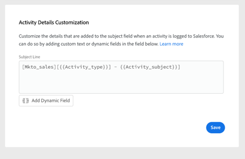

# 配置Salesforce活動詳細資訊自定義 {#configure-salesforce-activity-detail-customization}

>[!PREREQUISITES]
>
>* Salesforce和Sales Insight活動 [必須連接](/help/marketo/product-docs/marketo-sales-insight/actions/crm/salesforce-integration/connect-your-sales-insight-actions-account-to-salesforce.md)
>* 通過API記錄電子郵件活動 [必須啟用](/help/marketo/product-docs/marketo-sales-insight/actions/crm/salesforce-integration/salesforce-sync-settings.md)

Activity Detail Customization允許管理員配置在將Sales Insight Actions活動/提醒任務同步到Salesforce時將登錄到Salesforce Task - Subject Field的資訊。

>[!NOTE]
>
>* 如果您使用的是Sales Insight Actions中提醒任務的主題欄位，則對主題欄位所做的更新將反映在相應Salesforce任務的主題欄位中 `{{activity_subject}}` 「活動詳細資訊自定義」中的「動態」欄位。
>* 將資訊記錄到Salesforce主題欄位時不支援換行。 更新銷售任務主題時，「活動詳細資訊自定義」編輯器中的任何換行符都將被刪除。

<table>
 <tr>
  <td><strong>1</td>
  <td>InMail提醒任務</td>
 </tr>
 <tr>
  <td><strong>2</td>
  <td>電子郵件活動</td>
 </tr>
 <tr>
  <td><strong>3</td>
  <td>呼叫活動</td>
 </tr>
</table>

該功能可用於釋放以下好處：

* 通過自定義在主題欄位上可見的資訊，活動詳細資訊可以輕鬆掃描到Salesforce中的銷售。
* 管理員可以使用唯一標識符（如「Mkto_sales」）為主題欄位添加標籤，因此可以輕鬆識別Sales Insight Actions中的活動，並將其與其他電子郵件活動、呼叫活動和任務區別開來。
* 減少對自定義活動欄位的需求。 Salesforce強制限制自定義活動欄位的數量，這可以限制報表中可用的資料。 通過使用活動動態欄位將關鍵資料添加到主題行，您可以減少在Salesforce實例中建立的自定義活動欄位的數量。
* 活動和任務的主題欄位將遵循Sales Insight Actions Admin定義的一致模式。

>[!NOTE]
>
>如果您將電子郵件回復作為活動記錄到Salesforce，則它們將不使用Salesforce Activity Detail Customization設定。 而是以「回復：電子郵件主題。」

## 支援的活動動態欄位 {#activity-dynamic-fields-supported}

活動動態欄位參考有關您的銷售活動的資訊以填充資料。 現在，它們可以與Salesforce Activity Detail Customization一起使用。

>[!NOTE]
>
>如果沒有值可填充特定活動/任務的動態欄位，則在更新Salesforce Task - Subject Field時，它不會填充該動態欄位的任何資料。

<table>
 <tr>
  <th>欄位</th>
  <th>說明</th>
 </tr>
 <tr>
  <td>{{activity_type}}</td>
  <td>將以電子郵件、呼叫、InMail或自定義形式填充任務類型。</td>
 </tr>
 <tr>
  <td>{{activity_subject}}</td>
  <td>
將填充任務的主題。

      
如果是電子郵件，它將填充電子郵件的主題行。

      
在調用、inMail或自定義的情況下，如果在任務名稱/主題欄位中建立了一個值的提醒任務，則它將填充一個值。
</td>
 </tr>
 <tr>
  <td>{{sales_campigment_name}}</td>
  <td>如果活動是從銷售市場活動啟動的，它將填充銷售市場活動的名稱。</td>
 </tr>
 <tr>
  <td>{{sales_campigment_day}</td>
  <td>如果活動是從銷售市場活動啟動的，則它將填充此活動發生的銷售市場活動日期編號。</td>
 </tr>
 <tr>
  <td>{{sales_campigment_step}}</td>
  <td>如果活動是從銷售市場活動啟動的，它將填充此活動發生的銷售市場活動日內的步驟號。</td>
 </tr>
 <tr>
  <td>{{call_outme}}</td>
  <td>如果活動是呼叫，並且選擇了呼叫結果，則這將填充呼叫結果值。</td>
 </tr>
 <tr>
  <td>{{call_reason}}</td>
  <td>如果活動是呼叫，並且選擇了呼叫原因，則這將填充呼叫原因值。</td>
 </tr>
</table>

## 配置Salesforce活動詳細資訊自定義 {#configuring-salesforce-activity-detail-customization}

>[!NOTE]
>
>**需要管理權限。**

在配置活動詳細資訊時，請在查看Salesforce中的任務歷史記錄時考慮哪些資料與銷售最相關。

1. 按一下齒輪表徵圖並選擇 **設定**。

   

1. 按一下 **Salesforce**。

   

1. 按一下 **同步設定**。

   

1. 在「活動詳細資訊自定義」編輯器中，添加任何所需的自由文本。 您添加的文本是非動態的，對於同步到Salesforce的所有任務的主題欄位，該文本將保持不變。

   

   >[!TIP]
   >
   >雖然不需要，但將添加的文本用直括弧括起來可讓一些人更容易在資料填充到Salesforce的主題欄位時在資料之間辨別。 示例： `[Sales Insight Actions] - {{Activity_type}}`

1. 通過按一下 **添加動態欄位** 按鈕

   

1. 選擇所需的動態欄位。

   

1. 按一下 **保存**。

   

>[!NOTE]
>
>Salesforce強制執行255個字元的限制。 如果活動詳細資訊超過此值，則會截斷該詳細資訊，以確保資訊儲存在Salesforce主題欄位中。

>[!MORELIKETHIS]
>
>* [同步設定](/help/marketo/product-docs/marketo-sales-insight/actions/crm/salesforce-integration/salesforce-sync-settings.md)
>* [提醒任務與Salesforce同步](/help/marketo/product-docs/marketo-sales-insight/actions/tasks/reminder-task-sync-with-salesforce.md)

