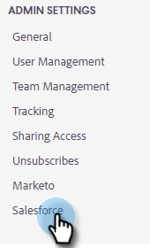

# 將您的[!DNL Sales Insight Actions]帳戶連線至[!DNL Salesforce] {#connect-your-sales-insight-actions-account-to-salesforce}

請依照下列簡單步驟將[!DNL Sales Insight Actions]帳戶連線至[!DNL Salesforce]。

## 如何以管理員身分連線 {#how-to-connect-as-an-admin}

1. 按一下齒輪圖示並選取&#x200B;**[!UICONTROL Settings]**。

   

1. 在[!UICONTROL Admin Settings]底下，按一下&#x200B;**[!UICONTROL Salesforce]**。

   

1. 在[!UICONTROL Connections & Customizations]索引標籤中，按一下&#x200B;**[!UICONTROL Salesforce]**&#x200B;然後&#x200B;**[!UICONTROL Connect]**。

   

1. 按一下「**[!UICONTROL OK]**」。

   

1. 如果您已登入Salesforce，即可連線。 否則，系統會要求您登入。

## 如何以非管理員身分連線 {#how-to-connect-as-a-non-admin}

1. 按一下齒輪圖示並選取&#x200B;**[!UICONTROL Settings]**。

   

1. 在[!UICONTROL My Account]下，選取&#x200B;**[!UICONTROL Salesforce]**。

1. 在[!UICONTROL Connections & Customizations tab]中，按一下&#x200B;**[!UICONTROL Salesforce]**&#x200B;然後&#x200B;**[!UICONTROL Connect]**。

   

1. 按一下「**[!UICONTROL OK]**」。

   

1. 如果您已登入Salesforce，即可連線。 否則，系統會要求您登入。
