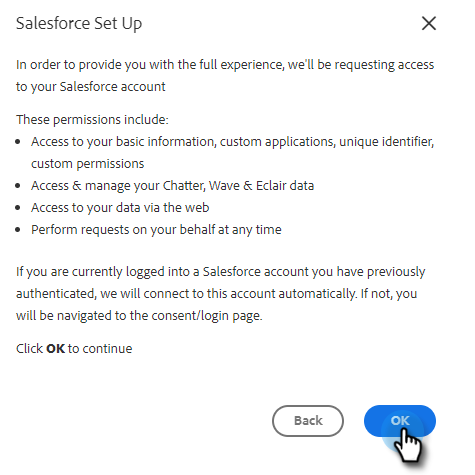

# 將您的Sales Insight Actions帳戶連接到Salesforce {#connect-your-sales-insight-actions-account-to-salesforce}

按照這些簡單步驟將Sales Insight Actions帳戶連接到Salesforce。

## 如何以管理員身份連接 {#how-to-connect-as-an-admin}

1. 按一下齒輪表徵圖並選擇 **設定**。

   

1. 在「Admin Settings（管理設定）」下，按一下 **Salesforce**。

   

1. 在「連接和自定義」頁籤中，按一下 **Salesforce** 然後 **連接**。

   

1. 按一下 **確定**。

   

1. 如果您已登錄到Salesforce，則將連接您。 如果不是，將要求您登錄。

## 如何以非管理員身份連接 {#how-to-connect-as-a-non-admin}

1. 按一下齒輪表徵圖並選擇 **設定**。

   

1. 在「我的帳戶」下，選擇 **Salesforce**。

1. 在「連接和自定義」頁籤中，按一下 **Salesforce** 然後 **連接**。

   

1. 按一下 **確定**。

   

1. 如果您已登錄到Salesforce，則將連接您。 如果不是，將要求您登錄。
