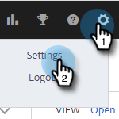
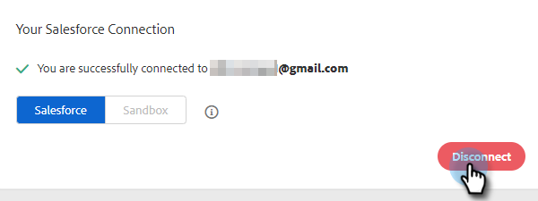

# 中斷與[!DNL Sales Insight Actions]的[!DNL Salesforce]連線 {#disconnect-salesforce-from-sales-insight-actions}

有時您可能需要中斷與[!DNL Sales Insight Actions]帳戶的[!DNL Salesforce]帳戶連線。 方法如下。

## 如何以管理員身分中斷與[!UICONTROL Salesforce]的連線 {#how-to-disconnect-from-salesforce-as-an-admin}

1. 在[!DNL Sales Insight Actions]中，按一下右上方的齒輪圖示並選取&#x200B;**[!UICONTROL Settings]**。

   

1. 在[!UICONTROL Admin Settings]底下，按一下&#x200B;**[!UICONTROL Salesforce]**。

   

1. 在[!UICONTROL Connections & Customizations]索引標籤中，按一下&#x200B;**[!UICONTROL Disconnect]**。

   

## 如何以非管理員身分中斷與[!DNL Salesforce]的連線 {#how-to-disconnect-from-salesforce-as-a-non-admin}

1. 在[!DNL Sales Insight Actions]中，按一下右上方的齒輪圖示並選取&#x200B;**[!UICONTROL Settings]**。

   

1. 在[!UICONTROL My Account]下，選取&#x200B;**[!UICONTROL Salesforce]**。

PICC

1. 在[!UICONTROL Connections & Customizations]索引標籤中，按一下&#x200B;**[!UICONTROL Disconnect]**。

PICC
