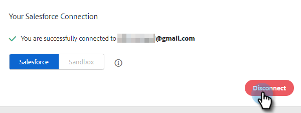

# 將Salesforce與Sales Insight動作中斷連線 {#disconnect-salesforce-from-sales-insight-actions}

有時您可能需要中斷與Sales Insight Actions帳戶的Salesforce帳戶連線。 方法如下。

## 如何以管理員身分中斷與Salesforce的連線 {#how-to-disconnect-from-salesforce-as-an-admin}

1. 在銷售分析動作中，按一下右上方的齒輪圖示並選取 **設定**.

   

1. 在管理設定下，按一下 **Salesforce**.

   

1. 在「連線和自訂」標籤中，按一下 **中斷連線**.

   

## 如何以非管理員身分中斷與Salesforce的連線 {#how-to-disconnect-from-salesforce-as-a-non-admin}

1. 在銷售分析動作中，按一下右上方的齒輪圖示並選取 **設定**.

   

1. 在我的帳戶下，選取 **Salesforce**.

PICC

1. 在「連線和自訂」標籤中，按一下 **中斷連線**.

PICC
