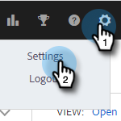

# Salesforce診斷 {#salesforce-diagnostics}

我們的Salesforce整合部分會在網頁應用程式中包含Salesforce診斷頁面。 此頁面會從記錄到Salesforce的失敗資料中擷取錯誤。 錯誤可能會有所幫助，但並不一定可讀取。 因此，我們會收集速查表來協助說明錯誤訊息。

## 存取診斷 {#access-diagnostics}

1. 按一下齒輪圖示，然後選擇 **設定**.

   

1. 在整合底下，按一下 **診斷**.

   

## 錯誤速查表 {#error-cheat-sheet}

**錯誤：** API_CURRENTLY_DISABLED\
**類別：** 存取/驗證\
**訊息：** 已針對此使用者停用API\
**最新動態：** 使用者沒有API存取權\
**疑難排解步驟：** Salesforce管理員需要授與使用者API存取權。

**錯誤：** AUTHENTICATION_FAILURE\
**類別：** 驗證\
**訊息：** invalid_grant：驗證失敗\
**最新動態：** 驗證失敗\
**疑難排解步驟：** 中斷與Salesforce的連線，然後重新連線。

**錯誤：** CANNOT_INSERT_UPDATE_ACTIVATE_ENTITY\
**類別：** 存取/驗證\
**訊息：** {&quot;errorCode&quot;：&quot;INVALID_SESSION_ID&quot;，&quot;message&quot;：&quot;工作階段已過期或無效&quot;}\
**最新動態：**

1 — 觸發程式碼導致更新失敗。\
2 — 使用者沒有特定物件的物件層級寫入許可權。

**疑難排解步驟：**

1 — 檢閱失敗的觸發器。\
2 — 將物件的寫入許可權授與使用者，或是停用嘗試寫入物件的功能。

**錯誤：** CANNOT_UPDATE_CONVERSION_LEAD\
**類別：** 其他\
**訊息：** 無法參考已轉換的潛在客戶\
**最新動態：** 我們嘗試在連絡人和潛在客戶的「最近活動記錄」期間記錄到已轉換的潛在客戶。 也看過這些推介詞。\
**疑難排解步驟：** 請向我們的 [支援團隊](https://nation.marketo.com/t5/Support/ct-p/Support).

**錯誤：** 實體_IS_LOCKED\
**類別：** 存取/驗證\
**訊息：** 實體已鎖定以進行編輯\
**最新動態：** 該記錄處於核准流程中，其被鎖定以防止任何額外的編輯，直到獲得擁有核准的人員核准或拒絕為止。\
**疑難排解步驟：** 請參閱上文。

**錯誤：** 已到期的存取
**類別：** 驗證
**訊息：** invalid_grant：過期的存取/重新整理Token
**最新動態：** 存取或重新整理Token已過期。 Token的到期日依據 [Salesforce中的工作階段設定](https://salesforce.stackexchange.com/questions/10759/invalid-grant-expired-access-refresh-token-error-when-authenticating-access-via).
**疑難排解步驟：** 您需要重新驗證。 中斷Salesforce連線並重新連線。

**錯誤：** FAILED_WRITE\
**類別：** 間歇性\
**訊息：** 已達檔案結尾\
**最新動態：** Salesforce的效能問題，可能是由於客戶端的觸發程式不佳所導致。\
**疑難排解步驟：** 重試邏輯應該會處理這個問題。 如果仍無法正常運作，請與Salesforce管理員合作，疑難排解有問題的觸發器。

**錯誤：** FIELD_CUSTOM_VALIDATION_EXCEPTION
**類別：** 存取/驗證
**訊息：** 因客戶而異。
**最新動態：** 物件的自訂驗證規則失敗。
**疑難排解步驟：** 檢查導致此錯誤的自訂驗證規則。 由於這是自訂規則，因此必須一次性處理錯誤。

**錯誤：** FIELD_FILTER_VALIDATION_EXCEPTION\
**類別：** 存取/驗證\
**訊息：** 值不存在或不符合篩選條件\
**最新動態：** Salesforce中現有的錯誤資料在更新時強制執行。\
**疑難排解步驟：** 請參閱上文。

**錯誤：** FIELD_INTEGRITY_EXCEPTION\
**類別：** 存取/驗證\
**訊息：** 現有的國家/地區不認得欄位的州值：州/省代碼\
**最新動態：** Salesforce中現有的錯誤資料在更新時強制執行。\
**疑難排解步驟：** 請參閱上文。

**錯誤：** INACTIVE_ORGANIZATION\
**類別：** 驗證\
**訊息：** invalid_grant：非作用中組織\
**最新動態：** 您的Salesforce組織已不在使用中。
**疑難排解步驟：** 中斷連線，然後從Salesforce重新連線。

**錯誤：** INACTIVE_USER
**類別：** 驗證
**訊息：** invalid_grant：非作用中的使用者
**最新動態：** 此Salesforce使用者已不在使用中
**疑難排解步驟：** 中斷連線，然後從Salesforce重新連線。

**錯誤：** INSERT_UPDATE_DELETE_NOT_ALLOWED_DURING_MAINTENANCE\
**類別：** 間歇性\
**訊息：** （無其他訊息）\
**最新動態：** Salesforce執行個體處於維護模式。\
**疑難排解步驟：** 請等待系統維護完成，然後再次嘗試記錄。

**錯誤：** UNFFECTED_ACCESS_ON_CROSS_REFERENCE_ENTITY
**類別：** 存取/驗證
**訊息：** 物件id的存取許可權不足
**最新動態：** 無任務之父記錄的存取權。
**疑難排解步驟：** 請參閱上文。

**錯誤：** UNFFECTED_ACCESS_OR_READONLY\
**類別：** 存取/驗證
**訊息：** 物件id的存取許可權不足
**最新動態：** 最近活動記錄無法編輯特定記錄，因為使用者沒有寫入許可權。\
**疑難排解步驟：** 在Salesforce中授與使用者存取權，或停用該使用者的該物件的「最近活動」記錄。

**錯誤：** INVALID_FIELD\
**類別：** 間歇性\
**訊息：** Net：：ReadTimeout\
**最新動態：** 請求逾時。 這可能是由於太多緩慢交易所致。\
**疑難排解步驟：** 檢閱現有的自訂，以瞭解延遲問題的可能原因，和/或停用一或所有物件的「最近活動」記錄，以減少負載。

**錯誤：** INVALID_FIELD_FOR_INSERT_UPDATE\
**類別：** 存取/驗證\
**訊息：** 無法建立/更新欄位： MSE_Replied__c。請檢查此欄位的安全性設定。
**最新動態：** 使用者沒有執行「最近活動」記錄交易所需的「銷售分析動作」自訂欄位的寫入許可權。 Team可能已經安裝封裝，但尚未為使用者啟用正確的欄位。\
**疑難排解步驟：** Salesforce管理員需要授與自訂欄位的存取權或關閉最近活動記錄。

**錯誤：** INVALID_GRANT\
**類別：** 驗證\
**訊息：** invalid_grant： ip已限制\
**最新動態：** 我們正在嘗試存取您的Salesforce，但您已經實施IP限制，因此我們無法進行存取。\
**疑難排解步驟：** 您的Salesforce管理員需要將我們的IP加入允許清單。 使用者應該聯絡支援以取得IP位址。

**錯誤：** INVALID_TYPE\
**類別：** 存取/驗證\
**訊息：** CreatedDate， （從任務中選取ID）來自潛在客戶，其中Email=&#39;emailid&#39;^ERROR在列:1:欄：53s不支援物件型別&#39;Lead&#39;。 如果您嘗試使用自訂物件，請務必在實體名稱后附加「__c」。 請參考您的WSDL或描述呼叫以取得適當的名稱
**最新動態：** 我們正在嘗試從Salesforce查詢使用者無權存取的物件型別。 這很可能是因為使用者沒有正確存取該Lead物件的許可權。\
**疑難排解步驟：** 授予Salesforce中Lead物件的讀取和更新存取權，或關閉電子郵件記錄和Lead記錄的「最近活動」記錄。

**錯誤：** QUERY_TIMEOUT\
**類別：** 間歇性\
**訊息：** 您的查詢要求執行時間太長\
**最新動態：** 請參閱上文。\
**疑難排解步驟：** 重試邏輯應該會處理這個問題。 如果仍無法正常運作，請與Salesforce管理員合作，疑難排解有問題的觸發器。

**錯誤：** REQUEST_LIMIT_EXCEEDED\
**類別：** 間歇性\
**訊息：**
1 — 超過ConcurrentPerOrgLongTxn限制\
2 — 超過TotalRequests限制\
3 — 並行請求\
**最新動態：**
1 — 超過並行請求限制，可能是因為觸發程式碼效率低。\
2 — 太多整合將組織置於24小時滾動視窗之外。\
**疑難排解步驟：**
1 — 檢閱受影響物件上的現有觸發器。 可能會停用一或多個物件的彙總記錄。\
2 — 從Salesforce購買更多API呼叫。 可能會停用一或多個物件的彙總記錄。

**錯誤：** REQUIRED_FIELD_MISSING\
**類別：** 存取/驗證\
**訊息：** 缺少必要欄位： `[Amount_Committed_Private_Capital__c]`
**最新動態：** 這通常會發生在最近的活動記錄中。 自訂欄位已設定為必填，但內含空白值。 如果記錄是使用自訂欄位的空值建立的，然後設定為必填，則可能會發生這種情況。 當我們嘗試更新記錄時，即使我們未觸及自訂欄位，需求會強制執行。\
**疑難排解步驟：** 手動更新缺少欄位的值。 接著，您可以重試銷售分析動作的訊息。

**錯誤：** 伺服器無法使用\
**類別：** 間歇性\
**訊息：** 伺服器太忙碌\
**最新動態：** Salesforce的效能問題，可能是由於客戶的觸發程式未達最佳狀態\
**疑難排解步驟：** 重試邏輯應該會處理這個問題。 如果仍無法正常運作，請與Salesforce管理員合作，疑難排解有問題的觸發器。

**錯誤：** TXN_SECURITY_NO_ACCESS\
**類別：** 存取/驗證\
**訊息：** 因為貴組織有安全性原則，所以不允許您要求的作業。 請聯絡您的管理員。**最新動態：** 已設定某種安全性限制 — 請參閱https://developer.salesforce.com/forums/?id=「記錄ID」\
**疑難排解步驟：** 請洽詢您的Salesforce管理員，並瞭解可能會有哪些特定限制。

**錯誤：** UNABLE_TO_LOCK_ROW\
**類別：** 間歇性\
**訊息：** 無法取得此記錄的獨佔存取權或1筆記錄：「記錄ID」\
**最新動態：** 可能有觸發程式導致多次嘗試存取相同記錄，可能是群組電子郵件。\
**疑難排解步驟：** 重試邏輯應該會處理這個問題。 如果仍無法正常運作，請與Salesforce管理員合作，疑難排解有問題的觸發器。

**錯誤：** 未知的例外狀況
**類別：** 其他\
**訊息：** 發生未知的例外狀況\
**最新動態：** Salesforce中未經處理的例外狀況。\
**疑難排解步驟：** 使用Salesforce建立案例，並複製錯誤訊息中的數值。 這是Salesforce程式碼未正確處理錯誤。
