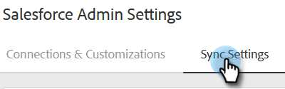

# 將銷售活動同步至 Salesforce {#sync-sales-activities-to-salesforce}

您可以設定「動作Salesforce同步設定」 ，以記錄電子郵件並呼叫Salesforce的活動。 這樣可讓團隊在您的CRM中工作時獲得更好的可見度，並可讓經理使用這些活動來建立自訂Salesforce報表，以追蹤團隊效能。

## 透過API將電子郵件活動記錄到Salesforce {#logging-email-activity-to-salesforce-via-api}

若要使用此功能，您必須使用Salesforce的Enterprise/Unlimited版本，或是Professional版本（如果您已透過Web Services API購買整合）。

>[!PREREQUISITES]
>
>Salesforce與銷售Insight動作必須連線。

1. 在銷售Insight動作中，按一下齒輪圖示並選取&#x200B;**設定**。

   

1. 在「管理員設定」（如果您不是管理員，則稱為「我的帳戶」）下，按一下&#x200B;**Salesforce**。

   

1. 按一下「**同步處理設定**」標籤。

   

1. 按一下「將電子郵件活動記錄到Salesforce」旁的箭頭。

   

1. 按一下「**Salesforce API**」標籤。 您可以在此卡片設定將資訊記錄到Salesforce的偏好設定。 完成時，按一下&#x200B;**儲存**。

   

## 透過電子郵件將電子郵件活動記錄到Salesforce到Salesforce （密件副本） {#logging-email-activity-to-salesforce-via-email-to-salesforce-bcc}

啟用「傳送電子郵件至Salesforce （密件副本）」後，您將會收到銷售電子郵件的密件副本，且您的電子郵件會記錄為商機、潛在客戶和聯絡人的活動。

>[!PREREQUISITES]
>
>Salesforce與銷售Insight動作必須連線。

**透過電子郵件（密件副本）將您的電子郵件登入Salesforce**

1. 在Marketo Sales中，按一下齒輪圖示並選取&#x200B;**設定**。

   

1. 在「管理員設定」（如果您不是管理員，則稱為「我的帳戶」）下，按一下&#x200B;**Salesforce**。

   

1. 按一下「**同步處理設定**」標籤。

   

1. 按一下&#x200B;**電子郵件至Salesforce （密件副本）**&#x200B;索引標籤，然後按一下&#x200B;**啟用**。

   

如果由於某些原因，您傳送至Salesforce的電子郵件位址沒有拉入，請按照下列步驟，在您的Salesforce帳戶中啟動密件副本功能：

1. 登入您的Salesforce執行個體。
1. 在右上角找到您的使用者名稱，然後選取下拉式清單。
1. 選取&#x200B;**我的設定**。
1. 選取&#x200B;**電子郵件**。
1. 選取&#x200B;**我的電子郵件至Salesforce**。
1. 在此頁面中，您會看到標示為「傳送電子郵件至Salesforce位址」的欄位。 如果旁邊未填入任何內容，請向下捲動至「我的可接受電子郵件地址」。
1. 輸入您要密件副本的電子郵件地址。
1. 按一下&#x200B;**儲存變更**。

**在我的設定中找不到我寄給Salesforce的電子郵件**

如果您在「設定」底下沒有看到「我的電子郵件至Salesforce」，表示您的管理員可能尚未啟用它。 如果您的團隊不熟悉Salesforce，或您的團隊從未使用Salesforce提供的密件副本地址，則可能會發生這種情況。

>[!NOTE]
>
>您需要管理員許可權才能設定此專案。

1. 按一下&#x200B;**設定**。
1. 按一下&#x200B;**電子郵件管理**。
1. 按一下&#x200B;**傳送電子郵件至Salesforce**。
1. 按一下&#x200B;**編輯**。
1. 勾選「使用中」旁的方塊。
1. 按一下&#x200B;**儲存**。

## 將銷售Insight動作任務/提醒同步至Salesforce任務 {#sync-sales-insight-actions-tasks-reminders-to-salesforce-tasks}

1. 在銷售Insight動作中，按一下齒輪圖示並選取&#x200B;**設定**。

   

1. 在「管理員設定」（如果您不是管理員，則稱為「我的帳戶」）下，按一下&#x200B;**Salesforce**。

   

1. 按一下「**同步處理設定**」標籤。

   

1. 按一下「將Marketo銷售工作/提醒同步至Salesforce工作」旁的箭頭。

   

1. 選擇所要的選項(預設會選取「不要同步至Salesforce工作」)。

   

## 首次與Salesforce同步銷售Insight動作工作 {#syncing-sales-insight-ations-tasks-with-salesforce-for-the-first-time}

當您首次開啟Sales Insight Actions與Salesforce工作之間的同步時，我們會匯入您的Salesforce工作。 我們不會將您在「銷售Insight動作」中擁有的任何目前工作推送到Salesforce。 為了減少雜湊和重複專案，從Sales Insight動作同步至Salesforce的唯一工作是在您將Sales Insight動作與SFDC同步後建立的工作。

同步處理Sales Insight動作和SFDC工作時，會發生下列情況：

* 當您在同步處理任務時按一下「儲存」，任務就會開始進行同步處理。 這最初需要一些時間。

* 過去24小時內已更新或建立的任何提醒都會從SFDC提取至Sales Insight動作。 同步是以到期日為基礎，所有這些工作都會在後端進行同步，但在指揮中心，您只會看到今天和明天到期的工作。

* 如果先前已開啟同步功能，而您又刪除了SFDC中的任何工作，則任何過去15天中刪除的工作都會從命令中心刪除。

* 只要同步功能已啟用，我們就會持續在Sales Insight Actions與SFDC之間同步工作。

* 初次同步後，您在Sales Insight Actions中建立、編輯、完成或刪除的任何工作都會同步至Salesforce中的工作清單。 在Salesforce中建立、編輯、完成或刪除的任何專案，都會更新您在銷售Insight動作中的任務清單。

* 若要開啟此同步，只要勾選Web應用程式中「設定」頁面中的同步方塊即可。
