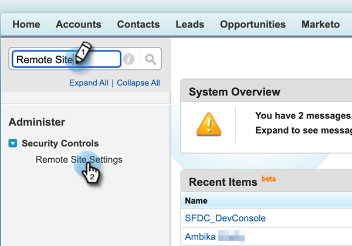

# Salesforce中的Sales Insight動作設定 {#sales-insight-actions-configuration-in-salesforce}

>[!PREREQUISITES]
>
>* [安裝](/help/marketo/product-docs/marketo-sales-insight/msi-for-salesforce/installation/install-marketo-sales-insight-package-in-salesforce-appexchange.md) 或 [升級](/help/marketo/product-docs/marketo-sales-insight/msi-for-salesforce/upgrading/upgrading-your-msi-package.md) Salesforce例項中的Sales Insight Package
>* [在Salesforce Enterprise/Unlimited中設定Marketo Sales Insight](/help/marketo/product-docs/marketo-sales-insight/msi-for-salesforce/configuration/configure-marketo-sales-insight-in-salesforce-enterprise-unlimited.md)

## 在Salesforce中新增遠端站台 {#add-new-remote-site-in-salesforce}

1. 在Salesforce中，按一下 **設定**.

   

1. 搜尋「遠端站台」並選取 **遠端站台設定**.
   

1. 按一下 **新增遠端站台**.

   

1. 輸入遠端網站名稱（可能類似「MarketoSalesInsight1」）。 輸入遠端站台URL `https://ims-na1.adobelogin.com` 並按一下 **儲存**.

   

1. 按一下 **新增遠端站台** 再來一次。

   

1. 輸入遠端網站名稱（可以類似於「MarketoSalesInsight2」）。 輸入遠端站台URL `https://mkto-sales-connect.adobe.io` 並按一下 **儲存**.

## 在整個CRM中啟用銷售分析動作 {#enabling-sales-insight-actions-across-the-crm}

1. 在Salesforce中，按一下 **Marketo銷售分析設定** 標籤。

   

   >[!NOTE]
   >
   >如果您在頂端列中看不到「Marketo銷售分析設定」，請按一下 **+** 在所有標籤下簽署並尋找它。

1. 選取 **啟用MSI動作** 核取方塊。

   

1. 輸入API金鑰。

   

   >[!NOTE]
   >
   >如果您沒有可用的API秘密金鑰，可以依照以下步驟找到： [本文](/help/marketo/product-docs/marketo-sales-insight/msi-for-salesforce/configuration/configure-marketo-sales-insight-in-salesforce-enterprise-unlimited.md).

1. 按一下 **儲存** 完成時。

這會自動啟用功能概觀文章中概述的所有MSI Actions功能。

>[!NOTE]
>
>只要取消勾選「啟用MSI動作」核取方塊，即可停用所有MSI動作功能。

## MSI動作控管 {#msi-actions-governance}

1. 您可以停用即將到來的區段中的Sales Campaigns及/或Task索引標籤。 這將適用於銷售機會、聯絡人、客戶和機會面板。

   

1. 您可以取消勾選「動作」設定下的對應功能，以停用MSI動作。

   

>[!NOTE]
>
>治理設定適用於所有MSI使用者。
