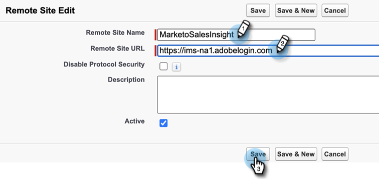
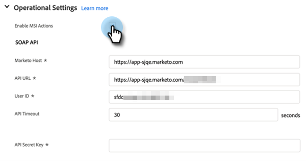

# 在[!DNL Sales Insight Actions]中的[!DNL Salesforce]設定 {#sales-insight-actions-configuration-in-salesforce}

>[!PREREQUISITES]
>
>* 在您的[執行個體中](/help/marketo/product-docs/marketo-sales-insight/msi-for-salesforce/installation/install-marketo-sales-insight-package-in-salesforce-appexchange.md)安裝[或](/help/marketo/product-docs/marketo-sales-insight/msi-for-salesforce/upgrading/upgrading-your-msi-package.md)升級[!DNL Salesforce]銷售Insight套件
>* [在 [!DNL Salesforce] Enterprise/Unlimited](/help/marketo/product-docs/marketo-sales-insight/msi-for-salesforce/configuration/configure-marketo-sales-insight-in-salesforce-enterprise-unlimited.md)中設定Marketo Sales Insight

## 在[!DNL Salesforce]中新增遠端站台 {#add-new-remote-site-in-salesforce}

1. 在[!DNL Salesforce]中，按一下&#x200B;**[!UICONTROL Setup]**。

   

1. 搜尋&quot;[!UICONTROL remote site]&quot;並選取&#x200B;**[!UICONTROL Remote Site Settings]**。
   

1. 按一下「**[!UICONTROL New Remote Site]**」。

   

1. 輸入遠端網站名稱（可能類似於「MarketoSalesInsight1」）。 輸入遠端站台URL `https://ims-na1.adobelogin.com`並按一下&#x200B;**[!UICONTROL Save]**。

   

1. 再按一下&#x200B;**[!UICONTROL New Remote Site]**。

   

1. 輸入遠端網站名稱（可能類似於「MarketoSalesInsight2」）。 輸入遠端站台URL `https://mkto-sales-connect.adobe.io`並按一下&#x200B;**[!UICONTROL Save]**。

## 正在啟用整個CRM的[!DNL Sales Insight Actions] {#enabling-sales-insight-actions-across-the-crm}

1. 在[!DNL Salesforce]中，按一下&#x200B;**[!UICONTROL Marketo Sales Insight Config]**&#x200B;標籤。

   

   >[!NOTE]
   >
   >如果您在頂端列中看不到&quot;[!UICONTROL Marketo Sales Insight Config]&quot;，請按一下&#x200B;**+**&#x200B;符號，並在「所有標籤」下找到它。

1. 選取&#x200B;**[!UICONTROL Enable MSI Actions]**&#x200B;核取方塊。

   

1. 輸入[!UICONTROL API Secret Key]。

   

   >[!NOTE]
   >
   >如果您沒有您的[!UICONTROL API Secrey Key]，可以按照[本文章](/help/marketo/product-docs/marketo-sales-insight/msi-for-salesforce/configuration/configure-marketo-sales-insight-in-salesforce-enterprise-unlimited.md)中的步驟找到它。

1. 完成時，按一下&#x200B;**[!UICONTROL Save]**。

這會自動啟用功能概觀文章中概述的所有MSI Actions功能。

>[!NOTE]
>
>只要取消勾選「啟用MSI動作」核取方塊，即可停用所有MSI動作功能。

## MSI動作控管 {#msi-actions-governance}

1. 您可以在即將到來的區段中停用Sales Campaigns及/或Task標籤。 這將適用於銷售機會、聯絡人、客戶和機會面板。

   

1. 您可以取消核取[!UICONTROL Actions settings]下對應的功能，以停用MSI動作。

   

>[!NOTE]
>
>治理設定適用於所有MSI使用者。
