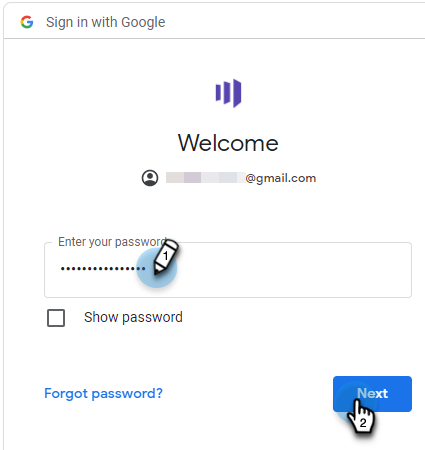

# 連線到Gmail {#connect-to-gmail}

連線到Gmail表示您將會收到回覆追蹤、存取Gmail傳遞頻道、在Gmail中排程電子郵件以及傳送合規性的功能。

>[!CAUTION]
>
>如果您是 [使用篩選器](https://support.google.com/mail/answer/6579?hl=en#zippy=%2Ccreate-a-filter%2Cedit-or-delete-filters){target="_blank"} 或Gmail帳戶中自動將電子郵件標示為已讀取的規則，這可能會導致回覆追蹤問題。 建議停用搭配Gmail使用回覆追蹤時，將電子郵件自動標示為已讀取的任何規則。

1. 在Marketo Sales中，按一下齒輪圖示並選取 **設定**.

   

1. 在我的帳戶下，選取 **電子郵件設定**.

   

1. 按一下 **電子郵件連線** 標籤。

   

1. 按一下 **開始使用**.

   

1. 選取 **我使用Gmail傳送電子郵件** 並按一下 **下一個**.

   

1. 按一下 **確定**.

   

1. 如果您已登入Gmail，請選擇您要連線的帳戶。 如果沒有，請輸入您的Gmail位址，然後按一下 **下一個**. 在此範例中，我們尚未登入。

   

1. 輸入您的密碼，然後按一下 **下一個**.

   

1. 按一下 **允許**.

   

   您可以使用此連線來追蹤電子郵件，也可以作為傳遞管道。

>[!NOTE]
>
>Gmail會強制實行自己的傳送限制。 [在此處瞭解更多](/help/marketo/product-docs/marketo-sales-connect/email/email-delivery/email-connection-throttling.md#email-provider-limits).
