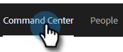
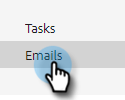

# 高級搜索概述 {#advanced-search-overview}

通過利用高級搜索到查看、按一下或答復電子郵件的目標潛在客戶，您可以建立您最投入的潛在客戶的目標清單。

## 如何訪問高級搜索 {#how-to-access-advanced-search}

1. 在Web應用程式中，按一下 **命令中心**。

   

1. 按一下 **電子郵件**。

   

1. 選擇適用的標籤。

   

1. 按一下「高級搜索」。

   

## 篩選器 {#filters}

**日期**

選擇搜索的日期範圍。 根據您選擇的電子郵件狀態（「已發送」、「未交付」、「待定」）更新預設日期。

**誰**

按電子郵件收件人/發件人在「Who」部分進行篩選。

<table>
 <tr>
  <td><strong>下拉</strong></td>
  <td><strong>說明</strong></td>
 </tr>
 <tr>
  <td><strong>查看方式</strong></td>
  <td>按Sales Connect實例中的特定發件人篩選（此選項僅對管理員可用）。</td>
 </tr>
 <tr>
  <td><strong>按組</strong></td>
  <td>按特定收件人組篩選電子郵件。</td>
 </tr>
 <tr>
  <td><strong>按人員</strong></td>
  <td>按特定收件人篩選。</td>
 </tr>
</table>

**當**

按建立日期、交付日期、失敗日期或計畫日期選擇。 可用選項會根據您選擇的電子郵件狀態（「已發送」、「未交付」、「待定」）而更改。

**市場活動**

按活動參與篩選電子郵件。

**狀態**

有三種電子郵件狀態可供選擇。 類型/活動選項根據選定的狀態而更改。

_**狀態：已發送**_

按您發送的電子郵件活動篩選。 您可以選擇視圖/無視圖、按一下/無按一下和/或回復/無回復。

_**狀態：待定**_

按所有待處理電子郵件進行篩選。

<table>
 <tr>
  <td><strong>狀態</strong></td>
  <td><strong>說明</strong></td>
 </tr>
 <tr>
  <td><strong>計畫</strong></td>
  <td>已從合成窗口（Salesforce或Web App）、電子郵件插件或市場活動中安排的電子郵件。</td>
 </tr>
 <tr>
  <td><strong>草稿</strong></td>
  <td>當前處於草稿狀態的電子郵件。 電子郵件需要主題行和收件人才能保存為草稿。</td>
 </tr>
 <tr>
  <td><strong>正在進行</strong></td>
  <td>正在發送的電子郵件。 電子郵件不應在幾秒鐘內處於此狀態。</td>
 </tr>
</table>

_**狀態：未交付**_

通過從未發送的電子郵件進行過濾。

<table>
 <tr>
  <td><strong>狀態</strong></td>
  <td><strong>說明</strong></td>
 </tr>
 <tr>
  <td><strong>失敗</strong></td>
  <td>當電子郵件無法從Sales Connect發送時(常見原因包括：正在向未訂閱/已阻止的聯繫人發送電子郵件，或在動態欄位中出現問題時)。</td>
 </tr>
 <tr>
  <td><strong>已跳轉</strong></td>
  <td>當電子郵件被收件人的伺服器拒絕時，它被標籤為已退回。 此處僅顯示通過Sales Connect伺服器發送的電子郵件。</td>
 </tr>
 <tr>
  <td><strong>垃圾郵件</strong></td>
  <td>收件人將電子郵件標籤為垃圾郵件（未經請求的電子郵件的常用術語）時。 此處僅顯示通過Sales Connect伺服器發送的電子郵件。</td>
 </tr>
</table>

## 保存的搜索 {#saved-searches}

下面是如何建立保存的搜索。

1. 所有篩選器都到位後，按一下 **將篩選器另存為**。

   

1. 為搜索指定名稱，然後按一下 **保存**。

   

您保存的搜索將位於左側的提要欄中。

