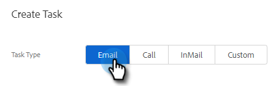
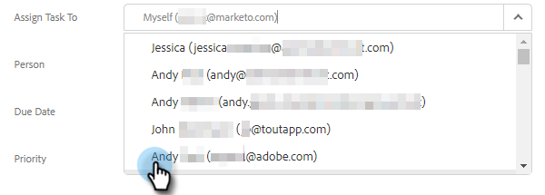
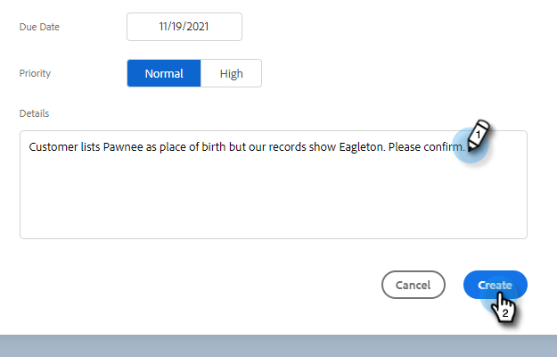

# 為團隊成員分配任務 {#assigning-tasks-to-team-members}

如果要與其他團隊成員協作，分配任務可以是協調勘察工作的絕佳方式。

>[!NOTE]
>
>您只能為共用聯繫人分配任務。

1. 在Web應用程式中，按一下 **指揮中心**.

   

1. 按一下 **添加任務**.

   

1. 選擇任務類型。

   

1. 為任務命名。

   

1. 在「分配任務」欄位中，選擇要分配任務的團隊中的人員。

   

1. 在「人員」欄位中新增您要聯絡的人員。

   

1. 選擇到期日。

   

1. 設定優先順序。

   

1. 添加與您的隊友相關的任何重要詳細資訊（可選），然後按一下 **建立**.

   
