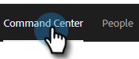

# 將任務分配給團隊成員 {#assigning-tasks-to-team-members}

如果您希望與其他團隊成員協作，分配任務可以是協調潛在客戶工作的極好方法。

>[!NOTE]
>
>您只能為共用聯繫人分配任務。

1. 在Web應用程式中，按一下 **命令中心**。

   

1. 按一下 **添加任務**。

   

1. 選擇任務類型。

   

1. 給任務命名。

   

1. 在「分配任務」(Assign Task)欄位中，選擇要將任務分配給的團隊中的人員。

   

1. 在「人員」欄位中添加要聯繫的人員。

   

1. 選擇到期日。

   

1. 設定優先順序。

   

1. 添加與隊友相關的任何重要詳細資訊（可選），然後按一下 **建立**。

   
