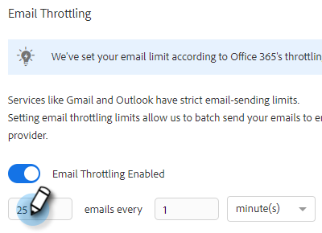

# 電子郵件連線節流 {#email-connection-throttling}

整合要透過Exchange或Gmail電子郵件供應商傳送的Sales Connect帳戶，提供簡化的設定，並最佳化一對一銷售通訊的電子郵件傳遞能力。 不過，為了維持系統運作和帳戶安全，Gmail和Exchange會強制執行電子郵件傳送限制。 這些限制可由提供者自行決定增加或減少。

## 電子郵件連線節流（測試版） {#email-connection-throttling-beta}

>[!AVAILABILITY]
>
>此功能目前處於Beta版。 若要加入，請聯絡Adobe客戶團隊（您的客戶經理）。

電子郵件連線節流可讓Sales Connect管理員在使用Gmail或Exchange作為您的傳遞管道時，設定電子郵件的傳送速率，讓電子郵件傳送給傳遞管道提供者的速率不超過強制的限制。

當限制持續超過時，有時可能會被視為來自傳送管道提供者的可疑行為，導致電子郵件失敗，有時甚至會停用帳戶。

**附註/重點**

* 使用者連線至Gmail或Exchange後自動啟用
* 如果您想要從建議中增加或減少設定以符合您的需求，則可自訂
* 僅節流透過Gmail或Exchange傳送的電子郵件，不會節流自訂傳遞通道
* 電子郵件連線節流會將每個個別使用者個別加入電子郵件佇列，因為每個使用者都有自己與電子郵件提供者的連線

**正在設定您的電子郵件連線節流設定**

1. 按一下齒輪圖示並選取 **設定**.

   

1. 在「管理設定」底下，按一下 **一般**.

   

1. 在右側的電子郵件連線節流卡中，按一下 **啟用電子郵件節流** 滑桿。

   

1. 在右側的電子郵件連線節流卡中，輸入所要的批次大小，這些批次大小會傳送給電子郵件通道提供者。

   

1. 設定每個批次傳送前的等待時間。 在此範例中，我們每45秒選擇25封電子郵件。

   

1. 按一下 **儲存**.

   

儲存變更後，所有使用者都會將其電子郵件批次傳送至其連線的Gmail或Exchange帳戶以進行傳送。

## 電子郵件提供者限制 {#email-provider-limits}

**Outlook 365**

商務/企業

* 每天10,000
* 每分鐘30次
* 每封電子郵件500位收件者

更多資訊 [可在此處找到](https://docs.microsoft.com/en-us/office365/servicedescriptions/exchange-online-service-description/exchange-online-limits?redirectedfrom=MSDN#RecipientLimits).

**Gmail**

* 每天2000個（試用和標幟帳戶為500個）
* 每秒2封電子郵件（API限制）
* 每則訊息2,000位收件者（外部收件者最多500位）

更多資訊 [可在此處找到](https://support.google.com/a/answer/166852?hl=en).

**Microsoft Exchange Server (2010、2013)**

限制由組織的IT部門設定，因為伺服器是由組織託管。 如有其他資訊，請聯絡網路或系統管理員。

>[!MORELIKETHIS]
>
>* [傳遞管道概觀](/help/marketo/product-docs/marketo-sales-connect/email/email-delivery/delivery-channel-overview.md)
>* [Gmail使用者的電子郵件連線](/help/marketo/product-docs/marketo-sales-connect/email-plugins/gmail/email-connection-for-gmail-users.md)
>* [Outlook使用者的電子郵件連線](/help/marketo/product-docs/marketo-sales-connect/email-plugins/msc-for-outlook/email-connection-for-outlook-users.md)
