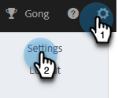
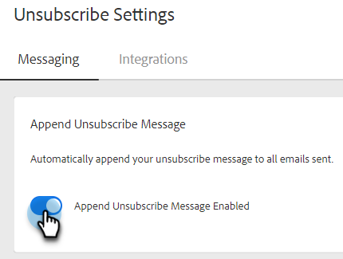

# 自動附加取消訂閱訊息設定 {#auto-append-unsubscribe-message-setting}

確保每封傳送的Sales Insight動作電子郵件都包含取消訂閱訊息，讓收件者可以輕鬆選擇退出通訊。 當啟用附加取消訂閱訊息時，您的團隊從Marketo Sales傳送的所有通訊將包含取消訂閱訊息，包括從網頁應用程式和Salesforce傳送的電子郵件。

>[!NOTE]
>
>如果您在電子郵件範本中使用`{{team_unsubscribe}}`動態欄位，且已啟用取消訂閱訊息附加設定，則團隊取消訂閱動態欄位將會填入您的取消訂閱訊息&#x200B;_，而非_&#x200B;附加您的取消訂閱訊息。

## 啟用/停用取消訂閱附加 {#enable-disable-unsubscribe-append}

1. 按一下齒輪圖示並選取&#x200B;**設定**。

   

1. 在[管理設定]下，按一下[取消訂閱]。****

   

1. 在「訊息」標籤中的「附加取消訂閱訊息」下方，將滑桿移動至所需的狀態。

   

>[!TIP]
>
>如果您停用附加取消訂閱訊息設定，建議將取消訂閱頁尾新增至您的範本，以確保您的通訊具有選擇退出選項。 您可以新增您自己的自訂訊息至每個範本，或使用`{{team_unsubscribe}}` [動態欄位](/help/marketo/product-docs/marketo-sales-insight/actions/templates/dynamic-fields.md){target="_blank"}來執行此操作。
