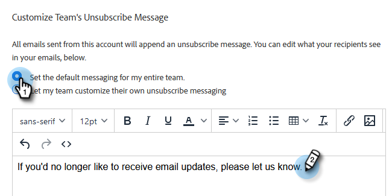

# 自定義取消訂閱連結消息 {#customize-unsubscribe-link-message}

我們始終允許團隊自定義其取消訂閱連結消息，但管理員可以選擇為其整個團隊設定取消訂閱連結消息以確保消息一致。

>[!NOTE]
>
>您不能使用與Marketo銷售部的第三方取消訂閱連結，因為此資訊不會被捕獲回我們的資料庫中。

1. 按一下齒輪表徵圖並選擇 **設定**。

   

1. 在「Admin Settings（管理設定）」下，按一下 **取消訂閱**。

   

1. 確定此消息是否是整個團隊的預設消息，或者您是否希望讓團隊建立他們自己的消息（在本例中，我們選擇預設消息）。 在文本框中寫出您的自定義消息。

   

1. 突出顯示希望用戶按一下以訪問取消訂閱頁面的文本，然後按一下連結表徵圖。

   

   >[!NOTE]
   >
   >輸入的URL無關緊要。 在發送電子郵件時，第一個（或僅一個）超連結將自動連結到預設的取消訂閱頁面。

1. 輸入URL，確定希望在當前或新窗口中開啟該連結，然後按一下 **保存**。

   

1. 按一下 **保存** 以保存更改。

   
