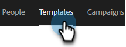

# 異動銷售電子郵件範本 {#transactional-sales-email-templates}

如果您的團隊要傳送交易或非商業電子郵件，您可以將電子郵件範本標示為非商業性範本，如此可略過取消訂閱。

## 注意事項 {#things-to-note}

* 非商業電子郵件將略過銷售取消訂閱和 [Marketo Engage取消訂閱檢查](/help/marketo/product-docs/marketo-sales-insight/actions/email/unsubscribes/marketo-unsubscribe-check.md){target="_blank"}, but will not bypass [blocked domains](/help/marketo/product-docs/marketo-sales-insight/actions/admin/blocked-domains.md){target="_blank"}.

* 取消訂閱的訊息不會自動附加至非商業電子郵件，即使 [附加取消訂閱訊息管理設定](/help/marketo/product-docs/marketo-sales-insight/actions/email/unsubscribes/auto-append-unsubscribe-message-setting.md){target="_blank"} is enabled. However, the `{{team_unsubscribe}}` [dynamic field](/help/marketo/product-docs/marketo-sales-insight/actions/templates/dynamic-fields.md){target="_blank"} 仍會填入您的團隊取消訂閱訊息。

## 設定非商業用途的電子郵件範本 {#configure-an-email-template-for-non-commercial-use}

1. 在標題中，按一下 **範本**.

   

1. 尋找並選取您要更新的範本。

   

1. 在「範本設定」底下啟用非商業電子郵件切換。

   

## 傳送非商業電子郵件 {#send-a-non-commercial-email}

>[!NOTE]
>
>選取取消訂閱的人員時，他們將會反白顯示為橙色。

1. 在標題中，按一下 **撰寫**. 尋找並選取所需的非商業範本。

   

1. 使用者會看到橫幅，顯示他們已選取非商業電子郵件範本。

   

1. 按一下 **傳送**.

   

即使該人已取消訂閱，仍會傳送電子郵件。
