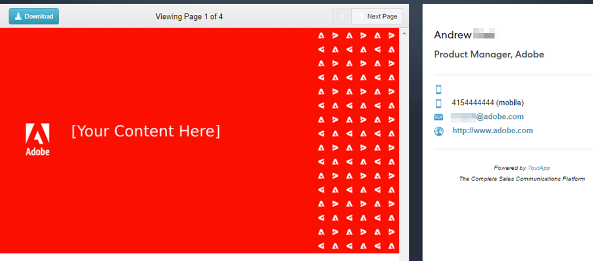

# 新增附件或可追蹤內容至您的電子郵件 {#add-an-attachment-or-trackable-content-to-your-email}

透過Marketo Sales傳送電子郵件時，您可以選擇新增檔案作為附件，或將檔案設為可下載（且可追蹤）連結。

>[!NOTE]
>
>通常，任何超過20MB的檔案都太大而無法傳送。 您可以透過電子郵件傳送的附件大小，會因您使用的電子郵件傳送通道而異。

## 新增附件 {#add-an-attachment}

1. 建立您的電子郵件草稿(有多種方式可以執行此操作，在此範例中，我們選擇 **撰寫** （在標題中）。

   

1. 填入「收件者」欄位並輸入「主旨」。

   

1. 按一下附件圖示。

   

1. 選取您要附加的檔案，然後按一下 **插入**.

   

   >[!NOTE]
   >
   >如果您需要上傳檔案，請按一下 **上傳內容** 按鈕。

   附件會顯示在電子郵件的底部。

   

## 新增可追蹤內容 {#add-trackable-content}

1. 建立您的電子郵件草稿（有多種方法執行此操作，在此範例中，我們選擇「撰寫」視窗）。

   

1. 填入「收件者」欄位並輸入「主旨」。

   

1. 按一下電子郵件中您希望可追蹤內容出現的位置，然後按一下附件圖示。

   

1. 選取您要新增的內容，按一下 **已追蹤內容** 滑桿，然後按一下 **插入**.

   

   >[!NOTE]
   >
   >如果您需要上傳檔案，請按一下 **上傳內容** 按鈕。

   內容會在您的電子郵件中顯示為連結。 收件者可以按一下連結以下載內容。

   

   >[!NOTE]
   >
   >當使用者檢視其追蹤的內容時，即時摘要中會通知使用者。 使用者也可以在Analytics頁面的內容區段中看到最高績效的內容。

## 可追蹤內容更新 {#trackable-content-updates}

**可追蹤內容檢視器**

當潛在客戶點按您電子郵件中的可追蹤內容時，它會開啟內容檢視器。

在內容檢視器潛在客戶可以執行下列操作。

* 下載檔案

* 翻閱檔案

* 檢視寄件者的連絡資訊

**即時摘要中的可追蹤內容事件**

當潛在客戶點按我們檔案的連結時，您將會看到點按事件。 您可以按一下該連結以檢視內容。 只要您已在瀏覽器中登入您的Actions帳戶，我們就不會將這些點按計為事件。

每次潛在客戶前進到檔案上的另一個頁面時，您將在即時摘要中收到一個已檢視事件，該事件顯示檔名稱。
