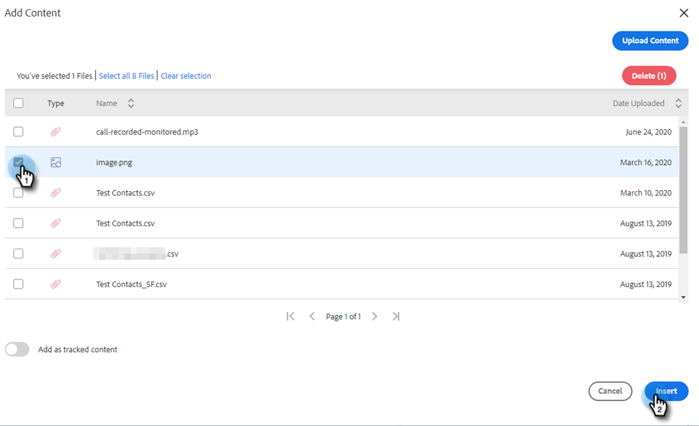
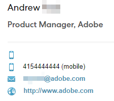

# 將附件或可追蹤內容新增至電子郵件 {#add-an-attachment-or-trackable-content-to-your-email}

透過Marketo Sales傳送電子郵件時，您可以選擇新增檔案作為附件，或將檔案設為可下載（且可追蹤）的連結。

>[!NOTE]
>
>通常，超過20MB的任何檔案都太大，無法傳送。 您可以透過電子郵件傳送的附件大小，會依您使用的電子郵件傳送通道而有所不同。

## 新增附件 {#add-an-attachment}

1. 建立電子郵件草稿(有多種方法可執行此作業，在此範例中，我們選擇 **撰寫** 中)。

   

1. 填入「收件人」欄位並輸入主旨。

   

1. 按一下附件圖示。

   

1. 選取要附加的檔案，然後按一下 **插入**.

   

   >[!NOTE]
   >
   >如果您需要上傳檔案，請按一下 **上傳內容** 按鈕。

   附件會顯示在您的電子郵件底部。

   

## 新增可追蹤內容 {#add-trackable-content}

1. 建立您的電子郵件草稿（有多種方法可執行此作業，在此範例中，我們選擇「撰寫」視窗）。

   

1. 填入「收件人」欄位並輸入主旨。

   

1. 按一下電子郵件中您希望可追蹤內容顯示的位置，然後按一下附件圖示。

   

1. 選取要新增的內容，按一下 **內容已追蹤** 滑桿，然後按一下 **插入**.

   

   >[!NOTE]
   >
   >如果您需要上傳檔案，請按一下 **上傳內容** 按鈕。

   內容會以連結的形式顯示在電子郵件中。 收件者可以按一下連結來下載內容。

   

   >[!NOTE]
   >
   >當使用者檢視其追蹤內容時，即時動態消息會通知使用者。 使用者也可以在Analytics頁面的內容區段中看到效能最高的內容。

## 可追蹤的內容更新 {#trackable-content-updates}

**可追蹤的內容檢視器**

當銷售機會點按您電子郵件中的可追蹤內容時，會開啟內容檢視器。

在內容檢視器內，銷售機會可以執行下列動作。

* 下載檔案

* 翻頁

* 查看發件人的聯繫資訊

**即時摘要中可追蹤的內容事件**

當銷售機會點按我們檔案的連結時，您會看到點按事件。 您可以按一下該連結來檢視內容。 只要您已登入瀏覽器的「動作」帳戶，我們就不會將這些點按計為事件。

每次銷售機會進入檔案上的其他頁面時，您就會在即時摘要中收到一個顯示檔案名稱的已檢視事件。
