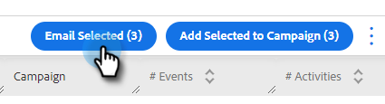
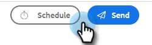

# 使用「選取並傳送」撰寫大量電子郵件 {#composing-bulk-emails-with-select-and-send}

以下說明如何使用「選取並傳送」選項傳送/編輯電子郵件。

## 傳送電子郵件 {#sending-emails}

1. 導覽至「人員」頁面。

   

1. 選取您要傳送電子郵件給的人。

   

   >[!NOTE]
   >
   >使用「選取並傳送」時，最多可以選取200人。

1. 按一下 **電子郵件已選取** 按鈕。

   

1. 輸入主旨列、選取範本（或從頭開始撰寫電子郵件），然後傳送/[排程](/help/marketo/product-docs/marketo-sales-connect/email/using-the-compose-window/scheduling-an-email.md) 電子郵件。

   

   >[!NOTE]
   >
   >如果您已選取範本，且想要在傳送前檢查所有動態欄位是否正確填入，請按一下 **預覽動態欄位**. 確保選取大量側邊欄中的所有收件者，以便預覽所有電子郵件。 如果您選取一封電子郵件並按一下 **預覽動態欄位**，則只會預覽該電子郵件。

## 編輯電子郵件 {#editing-emails}

**大量編輯**

1. 請遵循以下檔案中的步驟1-3： [傳送電子郵件區段](#sending-emails) 以上。

   >[!NOTE]
   >
   >預設會選取所有收件者。 如果您按一下個人且想要重新選取所有人，請按一下 **所有收件者**. 提醒您，必須選取所有收件者才能進行大量編輯。

1. 在編輯器中變更內容。 您可以建立新電子郵件或編輯範本（在此範例中，我們正在建立新電子郵件）。

   

   >[!NOTE]
   >
   >您可以按一下特定的電子郵件收件者，以檢視傳送至該電子郵件的變更。

1. 按一下 **傳送** (或 [排程](/help/marketo/product-docs/marketo-sales-connect/email/using-the-compose-window/scheduling-an-email.md))，以使用您所做的大量電子郵件更新傳送給所有收件者。

   

**編輯每封電子郵件**

在自訂每封電子郵件之前完成大量更新，因為進行大量更新會覆寫大量撰寫側邊欄中每封電子郵件的變更。

1. 請遵循以下檔案中的步驟1-4： [傳送電子郵件區段](#sending-emails).

   >[!NOTE]
   >
   >預設會選取所有收件者。 如果您按一下個人且想要重新選取所有人，請按一下 **所有收件者**. 提醒您，必須選取所有收件者才能進行大量編輯。

1. 選取個別收件者。

   

1. 在編輯器中變更內容。

   

   >[!NOTE]
   >
   >您可以在此處編輯大量側邊欄中的單一電子郵件，而不更新其餘電子郵件。

   >[!TIP]
   >
   >您可以按一下其他收件者，以檢視您對先前選取的收件者所做的變更不會顯示。

1. 按一下 **傳送** (或 [排程](/help/marketo/product-docs/marketo-sales-connect/email/using-the-compose-window/scheduling-an-email.md))，以使用您所做的大量電子郵件更新傳送給所有收件者。

   

   >[!MORELIKETHIS]
   >
   >* [大量電子郵件選項](/help/marketo/product-docs/marketo-sales-insight/actions/email/using-the-compose-window/bulk-emailing-options.md)
   >* [在撰寫視窗中使用範本](/help/marketo/product-docs/marketo-sales-connect/email/using-the-compose-window/using-a-template-in-the-compose-window.md)
   >* [動態欄位](/help/marketo/product-docs/marketo-sales-connect/templates/dynamic-fields/how-to-insert-dynamic-fields.md)
