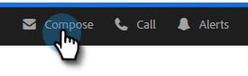

# 排程電子郵件 {#scheduling-an-email}

請依照下列簡單步驟來排程電子郵件。

>[!NOTE]
>
>若要更新預設時區，請前往「設定」頁面。

1. 建立電子郵件草稿(有多種方法可執行此作業，在此範例中，我們選擇 **撰寫** 中)。

   

1. 完成電子郵件的撰寫後，按一下 **排程** 右下角

   

1. 按一下日期以開啟日期選擇器並選取日期。

   

1. 輸入您希望電子郵件傳出的時間。 選取所需的時區，然後按一下 **儲存**. 完成時關閉排程器。

   

1. 現在已選取您的排程日期/時間，請按一下 **傳送** 排程電子郵件。

   

   >[!NOTE]
   >
   >您可以在命令中心的「排程資料夾」區段中檢視/編輯排程的電子郵件。

   >[!MORELIKETHIS]
   >
   >[命令中心概述](/help/marketo/product-docs/marketo-sales-insight/actions/email/command-center/command-center-overview.md)
