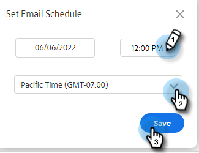

# 安排電子郵件傳送時間 {#scheduling-an-email}

請依照這些簡單的步驟排程電子郵件。

>[!NOTE]
>
>若要更新預設時區，請前往「設定」頁面。

1. 建立您的電子郵件草稿（有多種方式可以達成此目的，在此範例中，我們在標題中選擇&#x200B;**撰寫**）。

   

1. 當您完成撰寫電子郵件時，請按一下右下角的&#x200B;**排程**

   

1. 按一下日期以開啟日期選擇器並選取日期。

   

1. 輸入您要電子郵件發出的時間。 選取想要的時區，然後按一下[儲存]。**** 完成時關閉排程器。

   

1. 現在已選取您排程的日期/時間，請按一下[傳送] **以排程電子郵件。**

   

   >[!NOTE]
   >
   >您可以在命令中心的排程資料夾區段中檢視/編輯排程電子郵件。

   >[!MORELIKETHIS]
   >
   >[命令中心總覽](/help/marketo/product-docs/marketo-sales-insight/actions/email/command-center/command-center-overview.md)
