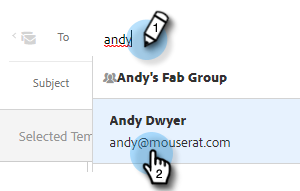

# 傳送被追蹤的電子郵件 {#sending-a-tracked-email}

使用Marketo Sales Connect傳送電子郵件時，將會追蹤檢視（電子郵件開啟）和點按（連結點按）。

>[!PREREQUISITES]
>
>您必須先驗證身分並設定電子郵件傳遞通道，才能傳送追蹤的電子郵件。
>
>* [驗證您的電子郵件地址](/help/marketo/product-docs/marketo-sales-insight/actions/getting-started/email-settings/verify-your-email.md)
>* 設定[Outlook](/help/marketo/product-docs/marketo-sales-connect/email-plugins/msc-for-outlook/email-connection-for-outlook-users.md)或[Gmail](/help/marketo/product-docs/marketo-sales-connect/email-plugins/gmail/email-connection-for-gmail-users.md)的傳遞通道

1. 建立您的電子郵件草稿（有多種方式可以達成此目的，在此範例中，我們在標題中選擇&#x200B;**撰寫**）。

   

1. 在&#x200B;**到**&#x200B;欄位中輸入收件者的名稱或電子郵件。

   

   >[!NOTE]
   >
   >「收件者」欄位中只能有一個人員。

1. 在個別欄位中新增您要「副本」或「密件副本」的任何收件者。

   

   >[!NOTE]
   >
   >如果有人曾收到副本或密件副本而開啟電子郵件，則該開啟將記錄為在&#x200B;**收件者**&#x200B;欄位中的人員記錄檢視。

1. 新增主旨列。

   

   >[!NOTE]
   >
   >傳送電子郵件需要主旨列和收件者。 新增主旨行和收件者後，我們將&#x200B;**自動儲存您的草稿**。

1. 使用編輯器撰寫電子郵件。 完成時，請按一下&#x200B;**傳送** （或者，如果您願意的話，請按一下[排程](/help/marketo/product-docs/marketo-sales-connect/email/using-the-compose-window/scheduling-an-email.md)）。

   

   >[!MORELIKETHIS]
   >
   >* [排程電子郵件](/help/marketo/product-docs/marketo-sales-insight/actions/email/using-the-compose-window/scheduling-an-email.md)
   >* [範本](/help/marketo/product-docs/marketo-sales-insight/actions/templates/manage-templates.md#create-a-new-template)
