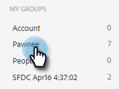
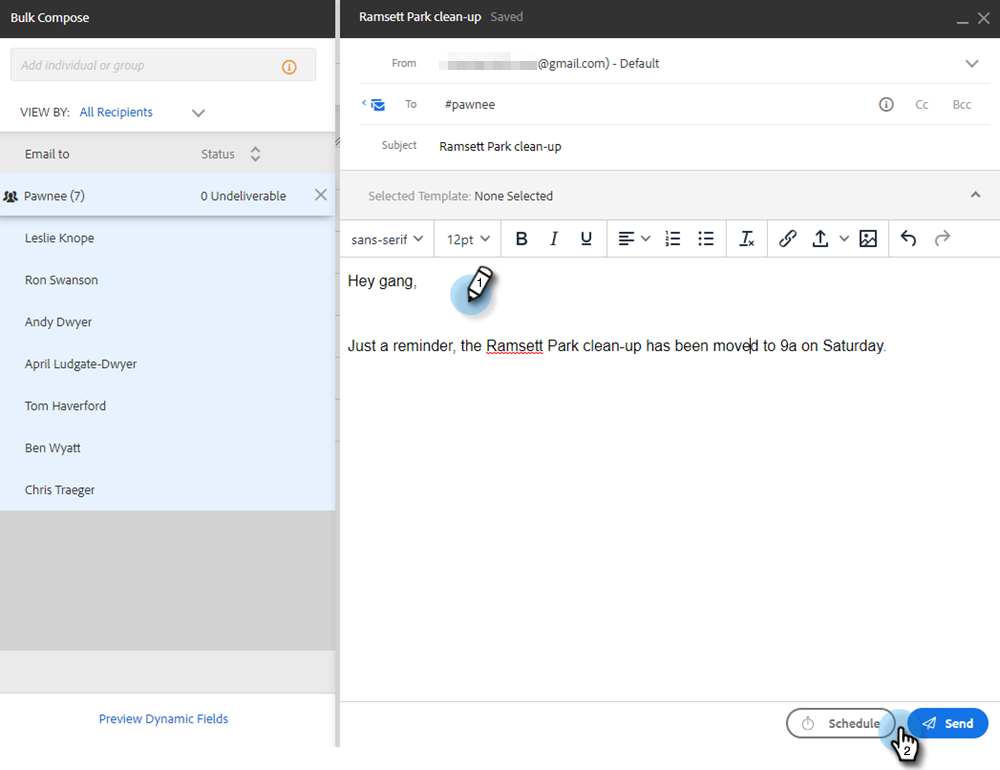

# 通過組電子郵件發送電子郵件 {#sending-emails-via-group-email}

下面是如何使用「組電子郵件」選項發送/編輯電子郵件。

## 發送組電子郵件 {#sending-a-group-email}

1. 按一下 **人物** 頁籤。

   

1. 選擇要發送電子郵件的組。

   

1. 按一下「組操作」按鈕，然後選擇 **電子郵件組**。

   

1. 填寫您的電子郵件（或選擇模板）併發送（或計畫）。

   

## 編輯組電子郵件 {#editing-a-group-email}

1. 使用 [上面步驟1-3](#sending-a-group-email)。

1. [選擇模板](/help/marketo/product-docs/marketo-sales-insight/actions/email/using-the-compose-window/using-a-template-in-the-compose-window.md)，或填寫您的電子郵件。

   

1. 完成電子郵件後，您現在可以預覽清單中的每封電子郵件，以查看動態欄位是否正確填充。

   

1. 選擇所需的收件人並按一下 **預覽動態欄位**。 查看右側的預覽。

   

   >[!NOTE]
   >
   >在發送組電子郵件時，您可以對電子郵件/模板進行批量編輯，但不能對清單中的特定收件人進行唯一編輯。

>[!MORELIKETHIS]
>
>* [批量發送選項](/help/marketo/product-docs/marketo-sales-insight/actions/email/using-the-compose-window/bulk-emailing-options.md)
>* [在合成窗口中使用模板](/help/marketo/product-docs/marketo-sales-insight/actions/email/using-the-compose-window/using-a-template-in-the-compose-window.md)

