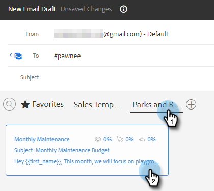
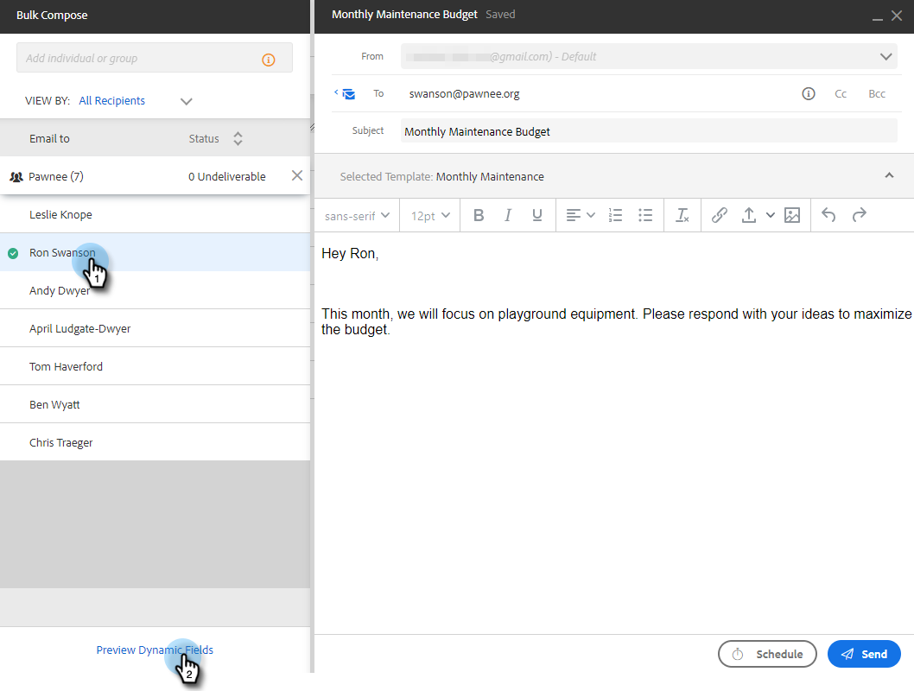

# 透過群組電子郵件傳送電子郵件 {#sending-emails-via-group-email}

以下說明如何使用「群組電子郵件」選項傳送/編輯電子郵件。

## 傳送群組電子郵件 {#sending-a-group-email}

1. 按一下「**[!UICONTROL People]**」標籤。

   

1. 選取您要傳送電子郵件的群組。

   

1. 按一下[!UICONTROL Group Actions]按鈕並選取&#x200B;**[!UICONTROL Email Group]**。

   

1. 填寫您的電子郵件（或選取範本）並傳送（或排程）它。

   

## 編輯群組電子郵件 {#editing-a-group-email}

1. 使用上述[步驟1-3建立群組電子郵件](#sending-a-group-email)。

1. [選擇範本](/help/marketo/product-docs/marketo-sales-insight/actions/email/using-the-compose-window/using-a-template-in-the-compose-window.md)，或填寫您的電子郵件。

   

1. 電子郵件完成後，您現在可以預覽清單中的每封電子郵件，以檢視動態欄位是否正確填入。

   

1. 選取所要的收件者並按一下&#x200B;**[!UICONTROL Preview Dynamic Fields]**。 在右側檢視預覽。

   

   >[!NOTE]
   >
   >您可在傳送群組電子郵件出站時，對電子郵件/範本進行大量編輯，但無法對清單中的特定收件者進行唯一編輯。

>[!MORELIKETHIS]
>
>* [大量傳送選項](/help/marketo/product-docs/marketo-sales-insight/actions/email/using-the-compose-window/bulk-emailing-options.md)
>* [在撰寫視窗中使用範本](/help/marketo/product-docs/marketo-sales-insight/actions/email/using-the-compose-window/using-a-template-in-the-compose-window.md)
