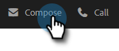

# 在撰寫視窗中使用範本 {#using-a-template-in-the-compose-window}

## 尋找及使用範本 {#finding-and-using-templates}

1. 建立您的電子郵件草稿(有多種方式可以執行此操作，在此範例中，我們選擇 **撰寫** （在標題中）。

   

1. 填入「收件者」欄位。

   

1. 按一下範本區段中的搜尋圖示，開啟範本搜尋欄位。

   

1. 選取要搜尋的類別（或選取全部以搜尋所有類別）。

   

1. 依範本名稱、主旨行或電子郵件內文搜尋。 按一下所需的範本以選取它。

   

   >[!NOTE]
   >
   >選取其他範本將會取代編輯器中目前的所有資訊。 如果您進行任何變更，請務必先複製變更，然後再選取其他範本。

## 在撰寫視窗中釘選範本類別 {#pinning-template-categories-in-the-compose-window}

我的最愛 **最多五個** 特定範本類別，以快速存取您最常用的範本。

1. 建立您的電子郵件草稿(有多種方式可以執行此操作，在此範例中，我們選擇 **撰寫** （在標題中）。

   

1. 按一下 **+** 圖示加以存取。

   

1. 按一下 **釘選類別** 下拉式清單，然後選取您想要的類別。

   

   >[!TIP]
   >
   >建議您釘選「全部」類別，讓快速存取來搜尋整個範本資料庫，因為您通常可能需要搜尋所有範本以找到您要尋找的內容。 當您選取釘選類別並按一下搜尋圖示時，搜尋將預設為所選釘選類別內的搜尋。

1. 按一下 **儲存變更** 完成時（選用：重複步驟3以新增更多）。

   

   >[!TIP]
   >
   >在儲存變更之前，您只需拖放即可重新排列釘選類別。

   

   >[!NOTE]
   >
   >**我的最愛** 預設為存在。 它包含最愛的電子郵件範本，而非類別。

   現在已釘選您選取的類別。
