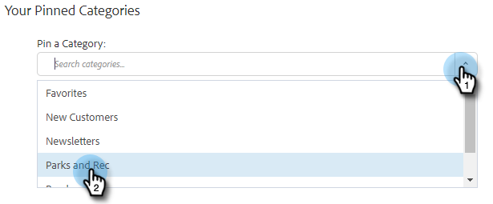

# 在合成窗口中使用模板 {#using-a-template-in-the-compose-window}

## 查找和使用模板 {#finding-and-using-templates}

1. 建立您的電子郵件草稿(有多種方法可以執行此操作，在本示例中，我們選擇 **合成** )的正平方根。

   

1. 填充「收件人」欄位。

   

1. 按一下模板部分中的搜索表徵圖以開啟模板搜索欄位。

   

1. 選擇要搜索的類別（或選擇「全部」以在所有類別中搜索）。

   

1. 按模板名稱、主題行或電子郵件正文搜索。 按一下所需模板以選擇它。

   

   >[!NOTE]
   >
   >選擇另一個模板將替換編輯器中當前的所有資訊。 如果進行了任何更改，請確保在選擇其他模板之前複製這些更改。

## 在合成窗口中固定模板類別 {#pinning-template-categories-in-the-compose-window}

收藏夾 **最多五個** 特定模板類別可快速訪問您最常用的模板。

1. 建立您的電子郵件草稿(有多種方法可以執行此操作，在本示例中，我們選擇 **合成** )的正平方根。

   

1. 按一下 **+** 表徵圖。

   

1. 按一下 **固定類別** 下拉並選擇所需的類別。

   

1. 按一下 **保存更改** 完成時（可選）:重複步驟3以添加更多內容)。

   

   >[!TIP]
   >
   >您只需在保存更改之前拖放即可重新排列固定的類別。

   

   >[!NOTE]
   >
   >**收藏夾** 預設情況下為。 它包含最喜愛的電子郵件模板，而不是類別。

   您選擇的類別現在已固定。
