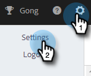
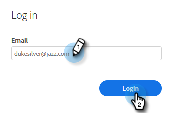

# 更改您的Marketo銷售密碼 {#change-your-marketo-sales-password}

需要更改密碼嗎？ 這是方法。

## 登錄時更改密碼 {#change-your-password-while-signed-in}

1. 按一下齒輪圖示並選取 **設定**.

   

1. 「我的配置檔案」頁預設會開啟。 在「帳戶詳細資訊」下，選取 **更改密碼** 核取方塊。

   

1. 輸入您當前的密碼。 然後輸入新的，並重新輸入，以確保兩者相符。 按一下 **儲存** 時才能使用。

   

>[!NOTE]
>
>密碼必須：
>
>* 至少包含9個字元
>* 使用混合大小寫（UPPER和LOWER）
>* 包括數字
>* 包含特殊字元

## 註銷時更改密碼 {#change-your-password-while-signed-out}

1. 導覽至 [Sales Connect登錄](https://toutapp.com/login) 頁面。 輸入您的電子郵件地址，然後按一下 **登入**.

   

1. 按一下 **忘記密碼**.

   

1. 輸入與帳戶相關聯的電子郵件地址，然後按一下 **傳送重設電子郵件**.

   

1. 我們會傳送電子郵件，確認帳戶擁有者想要變更密碼。 按一下 **重設密碼**.

   

   >[!NOTE]
   >
   >請務必也檢查您的垃圾郵件資料夾，因為此電子郵件有時會結束。

1. 輸入並確認您的新密碼。 按一下 **設定密碼** 時才能使用。

   
