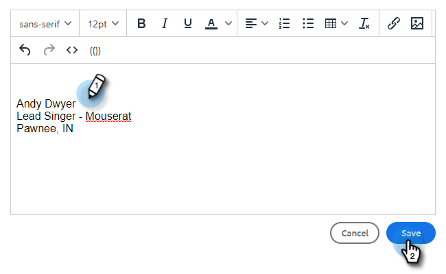

# 新增或更新您的電子郵件簽名 {#add-or-update-your-email-signature}

我們想從Marketo銷售部寄送電子郵件，以便在從您自己的電子郵件用戶端傳送時，感受到順暢的體驗。 執行此動作的絕佳方式是新增您的電子郵件簽名。

1. 按一下齒輪圖示並選取 **設定**.

   

1. 在「我的帳戶」下，選擇 **電子郵件設定**.

   

1. 在 **地址和簽名** 頁簽，選擇要為其建立簽名的電子郵件標識。

   

1. 在簽名卡中，按一下 **編輯**.

   

1. 輸入您想要的文字（或影像），然後按一下 **儲存**.

   

   >[!TIP]
   >
   >確定您在撰寫畫面中的簽名看起來類似於電子郵件用戶端中列出的簽名。
