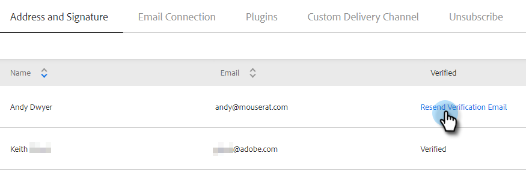

# 驗證您的電子郵件 {#verify-your-email}

如果您有未驗證的電子郵件身分，請遵循以下步驟。

1. 按一下右上方的齒輪圖示，然後選擇&#x200B;**[!UICONTROL Settings]**。

   

1. 在[!UICONTROL My Account]底下，按一下&#x200B;**[!UICONTROL Email Settings]**。

   

1. 在「[!UICONTROL Address and Signature]」下，找到您要驗證的電子郵件，然後按一下「**[!UICONTROL Resend Verification Email]**」。 將會傳送新的驗證電子郵件。

   

1. 按一下「**[!UICONTROL Resend]**」。

   

1. 收件者接著會開啟電子郵件，並依照步驟驗證電子郵件地址。

   

>[!NOTE]
>
>如果您沒有收到驗證電子郵件，請檢查您的垃圾郵件資料夾。 如果不在，請連絡[Marketo支援](https://nation.marketo.com/t5/Support/ct-p/Support)。
